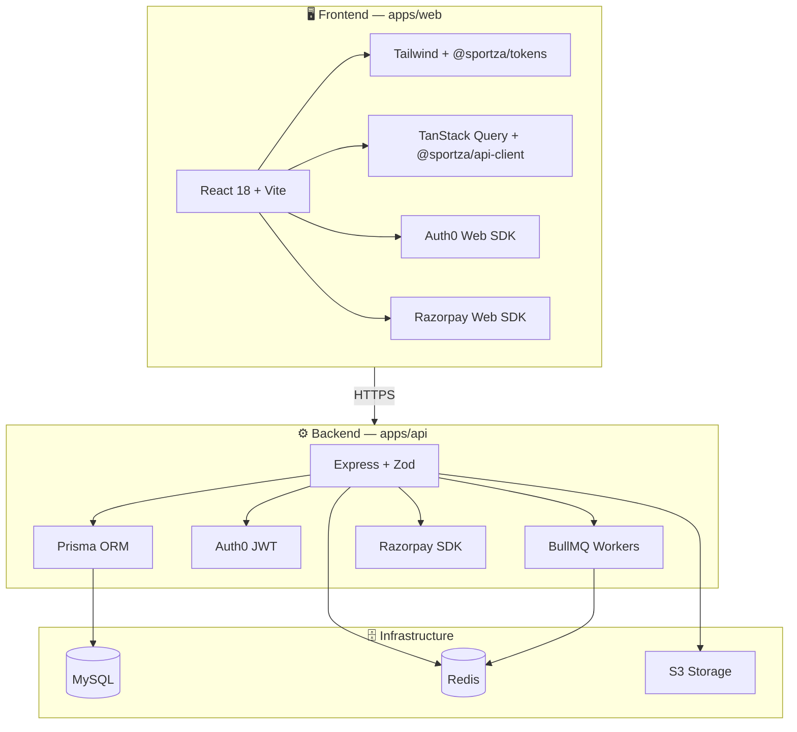

# Sportza

**हर दिन. Game On.**

Sportza is the smart platform for booking sports venues, training, and performance tracking. **Book. Train. Track.**

**Cursor mobile / Cloud Agents:** See [docs/CURSOR_MOBILE_SETUP.md](docs/CURSOR_MOBILE_SETUP.md) — connect GitHub, use [cursor.com/agents](https://cursor.com/agents) on your phone with repo `sanketpalekar-create/Sportza`.

**Railway deploy (recommended, full stack):** See [docs/RAILWAY.md](docs/RAILWAY.md) — MySQL + Redis + API + Web on Railway in ~15 minutes.

**Vercel deploy (optional):** See [docs/VERCEL.md](docs/VERCEL.md) — frontend + HTTP API on Vercel; managed MySQL + Redis; Cron for background jobs.

## Features

- **User Management**: Registration, Auth0 authentication (Google SSO, Email OTP, Magic Link), and user profiles
- **Venue Booking**: Browse, search, and book sports venues with multi-court support
- **Facility Surfaces**: Court/turf surface types (Clay, Hard Court, Synthetic Turf) during booking
- **Multi-Sport**: Cricket, Football, Basketball, Tennis, Badminton, Volleyball
- **Location-Based**: Filter by city (default: Pune)
- **Match Management**: Create matches, track scores, live scoring
- **Player Stats**: Automatic stats across matches, leaderboards, sport analytics
- **Open Play**: Discover, create, join open play sessions with skill-level badges
- **Training**: Trainer batches, sessions, attendance, payments, announcements
- **Tournaments**: Create and manage tournaments (groups, knockout, standings)
- **Role-based Views**: Player, Venue Owner (venues, bookings, reports), Trainer (batches, payments, reviews)
- **Payments**: Razorpay Web SDK for venue bookings
- **Design System**: Token-based theming and reusable UI components

## Tech Stack

### Frontend

- **React 18** + **Vite**, React Router v6, **Tailwind CSS**
- **Token-based Design System** (`packages/tokens`): colors, spacing, radii, fonts, shadows
- **Component Library** (`packages/ui`): Button, Input, Modal, Card, Badge, Table, DatePicker, Rating, StatCard
- **React Virtuoso**, Chart.js, **TanStack React Query**, React Hook Form + Zod
- **Auth0** (Google SSO + Email OTP), **Razorpay Web SDK**, Axios, **OpenAPI-generated API client**

### Backend

- **Node.js** + **Express**, **MySQL**, **Prisma ORM**
- **Auth0 JWT** middleware, **Nodemailer** (OTP + magic link), **Redis** (OTP/session), **BullMQ** (emails, refunds)
- **Razorpay SDK**, **Multer** + **S3** uploads, **OpenAPI Swagger** docs, **Zod** validation

### Packages

- `packages/tokens` — Design tokens
- `packages/ui` — 9 UI components
- `packages/api-client` — Axios + TanStack Query hooks (40+)

### Infrastructure

- **Turborepo** + **pnpm workspaces**
- **Docker**: MySQL, Redis, API, Web (4 services)



## Monorepo Structure

```
sportza/
├── apps/
│   ├── web/              # Vite + React + Tailwind
│   └── api/              # Express + Prisma + Zod + OpenAPI
├── packages/
│   ├── tokens/           # Design tokens (colors, spacing, radii, fonts, shadows)
│   ├── ui/               # Button, Input, Modal, Card, Badge, Table, DatePicker, Rating, StatCard
│   └── api-client/       # Axios + TanStack Query hooks
├── turbo.json
├── pnpm-workspace.yaml
├── docker-compose.yml
└── .env.example
```

## Installation

1. **Clone** the repository.

2. **Install dependencies:**
   ```bash
   pnpm install
   ```

3. **Set up environment:**
   ```bash
   cp .env.example .env
   ```
   Edit `.env` with:
   - `DATABASE_URL` — MySQL connection string
   - `REDIS_URL` — Redis URL
   - `AUTH0_*` — Auth0 domain, audience, client ID/secret
   - `RAZORPAY_*` — Payment keys
   - `S3_*` — S3-compatible storage
   - `SMTP_*` — Email for OTP and magic links

4. **Start infrastructure (MySQL, Redis):**
   ```bash
   docker compose up -d mysql redis
   ```

5. **Generate Prisma client and run migrations:**
   ```bash
   pnpm db:generate
   pnpm db:migrate
   ```

6. **Start development:**
   ```bash
   pnpm dev
   ```

   For a full Docker setup (all 4 services), run `docker compose up -d` instead.

## API Endpoints

### Auth (Auth0-based)

- `POST /api/auth/otp` — Send OTP to email
- `POST /api/auth/verify-otp` — Verify OTP and login
- `POST /api/auth/magic-link` — Send magic link to email
- `POST /api/auth/callback` — Auth0 callback (code exchange)
- `GET /api/auth/me` — Current user (requires auth)

### Other Routes

- **/api/sports** — Sports CRUD
- **/api/venues** — Venues, reviews, nearby
- **/api/bookings** — Create, cancel, check availability
- **/api/slots** — Slot availability
- **/api/payments** — Create order, verify, webhook
- **/api/matches** — Matches, scores, events
- **/api/stats** — Player stats, leaderboard
- **/api/batches** — Training batches, sessions, attendance
- **/api/trainers** — Trainer profiles, dashboard
- **/api/open-plays** — Open play CRUD, join/leave
- **/api/tournaments** — Tournaments, standings
- **/api/trainings** — Training discovery
- **/api/reports** — Revenue, booking reports

## Database

- **MySQL 8+** with **Prisma ORM** (45 models)

### Commands

```bash
pnpm db:generate   # Regenerate Prisma client
pnpm db:migrate    # Run migrations
pnpm db:push       # Push schema (dev)
pnpm db:studio     # Prisma Studio
```

## Documentation

- **TRACEABILITY.md** — Document index and requirement traceability
- **BRAND.md** — Product name, taglines
- **IMPLEMENTATION_STATUS.md** — Current implementation status
- **PRODUCT_MASTER_PLAN.md** — Consolidated product plan and requirement themes
- **PRODUCT_OPTIMIZATION_PLAN.md** — Improvement and optimization priorities
- **PRODUCT_PROGRESS_HISTORY.md** — Discussion and progress narrative
- **MARKET_RESEARCH_AND_STRATEGY.md** — Market framing, segments, and GTM direction
- **FEATURE_ROLLOUT_AND_TRACKER.md** — Rollout plan and feature-level tracking
- **BACKEND_ARCHITECTURE.md** — API structure, services, infrastructure
- **DEPLOYMENT.md** — Production deployment
- **USER_GUIDE.md** — End-user guide for players, owners, and trainers
- **PLAYER_LOGIN_AND_RATING_MANUAL.md** — Player guide for login and rating checks

## Development

- **API:** `http://localhost:5000`
- **Web:** `http://localhost:5173`
- **Swagger:** `http://localhost:5000/api/docs`
- **Health:** `GET /api/health`

### Commands

```bash
pnpm dev          # Run all apps in dev mode
pnpm build        # Build all apps
pnpm lint         # Lint
pnpm typecheck    # TypeScript check
```

## License

ISC
