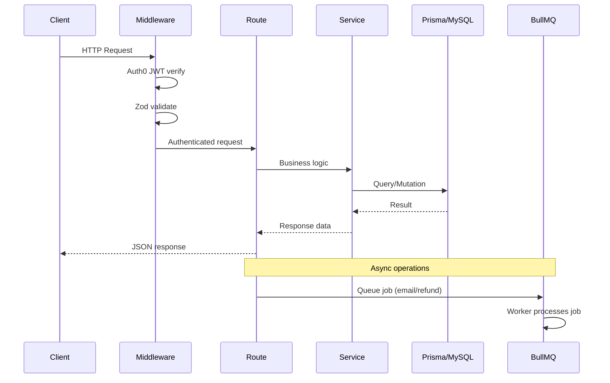

# Sportza — Backend Architecture

**Version:** 2.2  
**Last updated:** Apr 28, 2026

This document summarizes the backend architecture at `apps/api/`: folder structure, modules, API routes, database, auth, and infrastructure.

---

## 1. Folder Structure

```
apps/api/
├── src/
│   ├── index.ts           # Entry: Express app, Prisma connect, /api/health, /api/docs
│   ├── lib/               # Shared libraries
│   │   ├── prisma.ts      # Prisma client
│   │   ├── redis.ts       # ioredis client (OTP, session)
│   │   ├── queue.ts       # BullMQ queue setup
│   │   ├── email.ts       # Nodemailer
│   │   ├── storage.ts     # S3 uploads (Multer)
│   │   ├── openapi.ts     # OpenAPI spec generation
│   │   ├── errors.ts      # AppError hierarchy
│   │   ├── socket.ts      # Socket.io server singleton + room helpers
│   │   ├── bookingHelpers.ts          # Shared slot availability / hold logic
│   │   ├── tournament-player-stats.ts # Tournament W/L/NRR aggregation
│   │   └── progressShareToken.ts      # Time-limited public progress share tokens
│   ├── middleware/
│   │   ├── auth.ts        # Auth0 JWT (jwtCheck, attachUser, requireAuth)
│   │   ├── validate.ts    # Zod validation
│   │   └── errorHandler.ts # Centralized error handling
│   ├── routes/            # 20 route files
│   │   ├── auth.ts
│   │   ├── sports.ts
│   │   ├── venues.ts
│   │   ├── slots.ts
│   │   ├── bookings.ts
│   │   ├── payments.ts
│   │   ├── matches.ts
│   │   ├── stats.ts
│   │   ├── batches.ts
│   │   ├── trainers.ts
│   │   ├── open-plays.ts
│   │   ├── tournaments.ts
│   │   ├── reports.ts
│   │   ├── trainings.ts
│   │   ├── displays.ts
│   │   ├── peer-invites.ts
│   │   ├── matchmaking.ts
│   │   ├── notifications.ts
│   │   ├── schedules.ts
│   │   └── public.ts
│   ├── services/          # Business logic
│   │   ├── bookingConflict.ts
│   │   ├── openPlayConfirmations.ts
│   │   ├── refundService.ts
│   │   ├── scoring.ts
│   │   ├── matchLogging.ts
│   │   ├── tournamentFixtures.ts
│   │   ├── trainerService.ts
│   │   ├── elo.ts             # 7-factor ELO rating engine
│   │   ├── connections.ts     # PlayerConnection bidirectional upsert
│   │   ├── notificationService.ts  # createNotification() helper
│   │   └── whatsappBridge.ts  # WhatsApp deep-link URL generator
│   ├── workers/           # BullMQ workers
│   │   ├── emailWorker.ts
│   │   ├── refundWorker.ts
│   │   ├── ratingDriftWorker.ts  # Monthly 0.5% rating pull toward 1000
│   │   └── holdCleanupWorker.ts  # Expire stale booking holds
│   └── schemas/           # Zod schemas (if separated)
├── prisma/
│   └── schema.prisma
├── Dockerfile
└── package.json
```

---

## 2. Modules & Dependencies

| Package | Purpose |
|---------|---------|
| **express** | Web framework |
| **prisma** | ORM for MySQL |
| **zod** | Schema validation |
| **ioredis** | Redis client (OTP, session) |
| **bullmq** | Job queues (emails, refunds) |
| **express-oauth2-jwt-bearer** / **auth0** | Auth0 JWT middleware |
| **razorpay** | Payment gateway |
| **multer** + **@aws-sdk/client-s3** | File uploads to S3 |
| **nodemailer** | OTP, magic link emails |
| **swagger-ui-express** | OpenAPI docs at `/api/docs` |
| **helmet** | Security headers |
| **cors** | CORS handling |
| **morgan** | HTTP logging |
| **dotenv** | Environment config |

---

## 3. API Routes

| Base Path | Route File | Summary |
|-----------|------------|---------|
| `/api/auth` | auth.ts | OTP send/verify, magic-link, callback, /me, forgot-password, reset-password, refresh |
| `/api/sports` | sports.ts | List, get by id/name, CRUD |
| `/api/venues` | venues.ts | List, get, reviews, CRUD, uploads |
| `/api/slots` | slots.ts | Slot availability per venue/facility |
| `/api/bookings` | bookings.ts | List, get, create, cancel, multi-court, check-availability |
| `/api/payments` | payments.ts | Create order, verify, webhook, booking status |
| `/api/matches` | matches.ts | List, get, create, scores, player-stats, complete |
| `/api/stats` | stats.ts | Player stats, leaderboard, matches |
| `/api/batches` | batches.ts | CRUD, discover, join, sessions, attendance, announcements |
| `/api/trainers` | trainers.ts | List, get, dashboard, profile, venues |
| `/api/open-plays` | open-plays.ts | List, get, create, join, leave |
| `/api/tournaments` | tournaments.ts | List, get, create, standings, fixtures |
| `/api/reports` | reports.ts | Revenue, booking reports (venue monthly, trainer monthly, platform monthly) |
| `/api/trainings` | trainings.ts | Discovery, batch detail |
| `/api/displays` | displays.ts | VenueDisplay management; DisplayPairing generate, claim, status |
| `/api/peer-invites` | peer-invites.ts | Send, receive, respond to, cancel peer play invitations |
| `/api/matchmaking` | matchmaking.ts | Suggestions (skill-band), network, skill-rating, rating-history, initialize-ratings |
| `/api/notifications` | notifications.ts | List, unread-count, mark-read, mark-all-read, delete |
| `/api/schedules` | schedules.ts | Venue schedule management (availability windows, slot generation) |
| `/api/public` | public.ts | Unauthenticated: venue discovery, public player profiles, progress share by token |

**Health:** `GET /api/health`  
**Swagger:** `GET /api/docs`, `GET /api/docs.json`  
**Real-time:** Socket.io server on same port; rooms `match:<matchId>` (live scoring) and `pairing:<token>` (display pairing)



---

## 4. Database

- **Engine:** MySQL 8.0+
- **ORM:** Prisma
- **Models:** 53 (User, Venue, Booking, Match, Tournament, Batch, OpenPlay, VenueDisplay, DisplayPairing, SportSkillRating, RatingHistory, PlayerConnection, PeerPlayInvite, Notification, RefreshToken, etc.)

Key models: User, Otp, TrainerProfile, Venue, SportFacility, Booking, SplitPayment, OpenPlay, Match, MatchEvent, Tournament, TournamentFixture, Batch, BatchSession, SessionAttendance, BatchPayment, PlayerStats, Refund, SportSkillRating, RatingHistory, PlayerConnection, PeerPlayInvite, Notification, RefreshToken, and related entities.

See `docs/DATA_MODEL.md` for full schema documentation.

---

## 5. Authentication

- **Auth0 JWT:** `jwtCheck`, `attachUser`, `requireAuth` middleware for protected routes
- **OTP:** Redis-backed; Nodemailer sends 6-digit OTP
- **Magic link:** Token in Redis; Nodemailer sends link; verify on callback
- **Google SSO:** Via Auth0 (handled on frontend; JWT issued by Auth0)
- **Password reset:** Time-limited token (15 min, hashed); `POST /api/auth/forgot-password` + `POST /api/auth/reset-password`
- **Refresh tokens:** 7-day rotating tokens in `RefreshToken` table; rotated on each use; revoked on logout and password reset

---

## 6. Infrastructure

| Component | Purpose |
|-----------|---------|
| **Redis** | OTP storage, rate limiting, session/cache |
| **BullMQ** | Email, refund, rating-drift, hold-cleanup queues and workers |
| **S3** | Multer multipart → S3-compatible storage (venue images, etc.) |
| **Nodemailer** | SMTP for OTP, magic link, and password reset emails |
| **Socket.io** | Real-time rooms: `match:<matchId>` (scoring) + `pairing:<token>` (display pairing) |
| **PM2** | Process manager for production API and web processes |
| **Nginx** | Reverse proxy: `/api` → Express 3000; `/` → Vite static; SSL termination |

---

## 7. Error Handling

- **AppError** hierarchy in `lib/errors.ts`:
  - `AppError` (base)
  - `NotFoundError` (404)
  - `BadRequestError` (400)
  - `UnauthorizedError` (401)
  - `ForbiddenError` (403)
  - `ConflictError` (409)
  - `ValidationError` (422, with path/message array)

- **Structured responses:** `{ success: false, code, message, errors? }`
- **Centralized:** `errorHandler` middleware catches and formats all errors

---

## References

- **Document index:** [TRACEABILITY.md](TRACEABILITY.md)
- **Data model:** [DATA_MODEL.md](DATA_MODEL.md)
- **Deployment:** [DEPLOYMENT.md](DEPLOYMENT.md)
