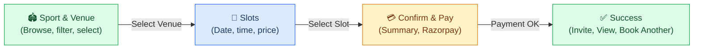

# Booking Flow UX Specification

**Version:** 2.0  
**Last updated:** Mar 2026

This document defines the **InstantBook Flow** as the core revenue engine. The flow must feel: **Fast**, **Clean**, **Trustworthy**, **Premium** — with **3 taps** to confirm.

---

## 1. Booking UX Goal

### User mindsets

| User type | Mindset | Flow must deliver |
|-----------|---------|--------------------|
| **Casual** | “I just want to quickly book a slot.” | Clear, predictable, minimal steps |
| **Competitive** | “I need correct timing, facility, and maybe split payment.” | Precision + optional split, no confusion |

### Principles

- **Clear** — No ambiguity about what is being booked or paid.
- **Predictable** — Same structure every time; users know what comes next.
- **Zero confusion about pricing** — Subtotal, GST, add-ons, total always visible when relevant.
- **Transparent** — GST and split logic shown explicitly; no hidden fees.

---

## 2. InstantBook Flow Structure (3-Tap)



```
Tap 1: Sport & Venue
  ↓
Tap 2: Slots
  ↓
Tap 3: Confirm & Pay → Success
```

**Interaction rule:** Max 3 major screens to confirmation. Sticky CTA and total amount always visible where relevant.

---

## 3. Screen-by-Screen UX Breakdown

### Tap 1: Sport & Venue

**Purpose:** Choose sport and venue before slot selection.

#### Layout structure

| Zone | Content |
|------|--------|
| **Top** | Sport selector (Badge/chips) |
| **Middle** | Venue cards (Card component), filters |
| **Bottom** | **Sticky “Select Venue” / “View Slots” CTA** |

#### UX rules

- Sport selected first; venues filtered by sport.
- Venue cards show name, location, rating, price hint.
- Uses **@sportza/ui** components: Card, Button, Badge.

---

### Tap 2: Slots

**Purpose:** Choose date and time slot; see price update in real time.

#### Layout structure

| Zone | Content |
|------|--------|
| **Top** | Selected venue, **DatePicker** (@sportza/ui) |
| **Middle** | Grid of available slots (time blocks) |
| **Bottom** | **Sticky bar:** Selected slot, Price, **Continue** button |

#### UX rules

- **DatePicker** from @sportza/ui for date selection.
- Slots fetched via **GET /slots/venue/:venueId** (query: date, sport, facility?).
- Price displayed per slot; **FacilityPricingRule** applied server-side (TIME_BASED, DAY_BASED, PEAK_HOUR, etc.).
- Sticky CTA: “Confirm & Pay” or “Continue”.

#### Slot states

| State | Visual | Interaction |
|-------|--------|--------------|
| **Available** | Card, primary border | Tappable |
| **Selected** | Card, accent fill | Tappable, can deselect |
| **Booked** | Muted, disabled | Not tappable |

---

### Tap 3: Confirm & Pay → Success

**Purpose:** Review, pay, and land on success with post-booking actions.

#### Layout structure

| Zone | Content |
|------|--------|
| **Top** | Booking summary (venue, date, time, facility, total) |
| **Middle** | Price breakdown (subtotal, GST, total), payment UI |
| **Bottom** | **Pay Now** button |

#### Pricing (server-side)

- **FacilityPricingRule** applied when creating booking:
  - `ruleType`: TIME_BASED, DAY_BASED, PEAK_HOUR, WEEKEND, etc.
  - `ruleValue`, `metadata` used for calculation.
- API: **POST /bookings/instant** with venueId, facilityId, slotId (or startTime/endTime), sport.

#### Post-booking actions (Success screen)

- **Invite Players** — One-tap to create Open Play or share booking.
- **View Booking** — Navigate to `/bookings/:id`.
- **Book Another** — Return to Sport & Venue or Venues list.

---

## 4. UI Components (@sportza/ui)

| Component | Usage |
|-----------|--------|
| **DatePicker** | Date selection in slot step |
| **Card** | Venue cards, slot cards, summary card |
| **Button** | Primary CTAs (Select Venue, Confirm & Pay, Pay Now) |
| **Badge** | Sport chips, status labels, slot labels |

---

## 5. API Summary

| Method | Endpoint | Purpose |
|--------|----------|---------|
| GET | `/slots/venue/:venueId` | Fetch available slots for venue (query: date, sport, facilityId?) |
| POST | `/bookings/instant` | Create instant booking (venueId, facilityId, slot/time, sport, etc.) |

Pricing is applied server-side via **FacilityPricingRule** (TIME_BASED, DAY_BASED, PEAK_HOUR, etc.).

---

## 6. UX Micro-Details

### Error handling

**Slot booked during payment**

- Show **modal:** “Slot no longer available.”
- **Action:** Return user to Slots step to choose another slot.

### Real-time price update

- Price updates when slot is selected.
- No lag; no “loading” for price; server returns computed price for selected slot.

### Open Play integration (post-booking)

- After success, show **“Invite Players”** or **“Create Open Play”**.
- One-tap path to Create Open Play flow.

---

## 7. Interaction Rules (Summary)

| Rule | Implementation |
|------|----------------|
| 3 taps to book | Sport & Venue → Slots → Confirm & Pay |
| Sticky CTA | Each step has clear primary action |
| Total visible before payment | Confirm step shows full breakdown |
| Post-booking actions | Invite Players, View Booking, Book Another |

---

## 8. UX Psychology Strategy

**Trust = transparency.**

- **Show GST clearly** — Line item in breakdown.
- **No hidden fees** — All components of the total are listed.
- **Clean breakdown** — Readable typography, clear hierarchy.

**Premium feel**

- Predictable flow, instant feedback, clear success state.
- Success screen as the “reward” and bridge to next action (Invite Players, View Booking, Book Another).

---

## References

- **Navigation:** `docs/NAVIGATION.md`
- **Data model:** `docs/DATA_MODEL.md` (FacilityPricingRule, Slot, Booking)
