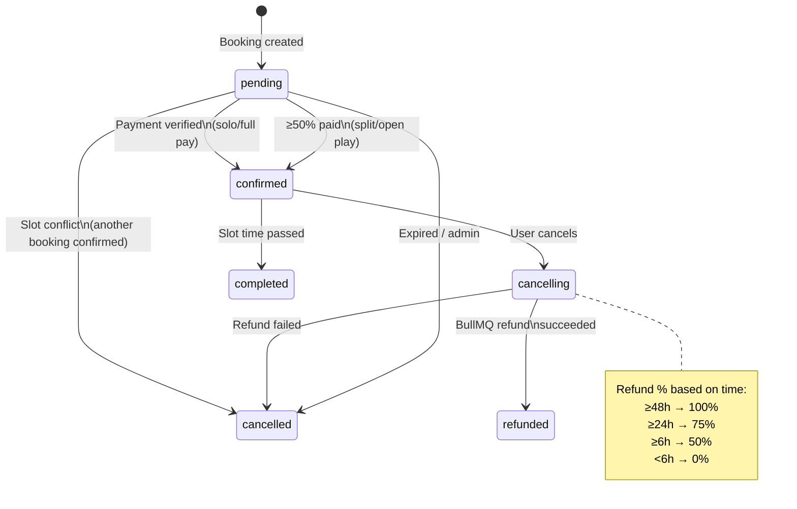

# Sportza — Booking State & Flows (MVP Architecture)

**Version:** 3.0  
**Last updated:** Mar 2026  
**Status:** Enterprise-grade reservation engine — payment-priority · real-time · time-based refund · transparent

This document is the **single source of truth** for the booking engine: philosophy, booking types, confirmation rules, states, slot competition, pricing, refund policy, payment flow, and cancellation logic. Use it for FRD / PRD / Figma notes and implementation.

**Project:** Turborepo monorepo — `apps/web` (Vite + React + Tailwind + Auth0 + TanStack Query), `apps/api` (Express + Prisma + Zod + OpenAPI + Redis + BullMQ), `packages/tokens`, `packages/ui`, `packages/api-client`.

---

## 1. Core philosophy

The booking system is:

- **Marketplace-driven**
- **Payment-priority based**
- **Real-time competitive**
- **Fair refund structured** (time-based policy)
- **Transparent**
- **Premium & calm**

It is **not** simple first-come-first-serve.

---

## 2. Booking statuses

| Status | Meaning |
|--------|---------|
| **pending** | Created but not yet confirmed (e.g. <50% paid for split) |
| **confirmed** | Paid and slot secured |
| **cancelling** | Cancellation requested; refund job queued (BullMQ) |
| **cancelled** | Cancelled without refund or refund failed |
| **refunded** | Cancelled and refund completed via BullMQ worker |
| **completed** | Slot time passed |

---

## 3. Instant booking flow (3-tap)

For solo bookings, the flow is optimized for speed:

1. **Tap 1 — Select slot:** User selects date, facility, and time slot.
2. **Tap 2 — Confirm & pay:** Razorpay create-order → user pays via UPI/card/net banking.
3. **Tap 3 — Done:** Payment verified → webhook → booking confirmed; redirect to confirmation.

Total: 3 taps from slot selection to confirmation. No extra forms; payment is the confirmation step.

---

## 4. Multi-court booking (groupId linking)

Related bookings can be linked with `groupId` for:

- **Atomic creation:** Multiple facilities in one action; all-or-nothing.
- **Unified payment:** Create order for total; verify updates all linked bookings.
- **Conflict resolution:** If one slot is taken, entire group is cancelled or reverted.
- **Cancellation:** Cancelling one booking in a group cancels all linked bookings.

`Booking.groupId` stores the shared identifier. Implementation: `apps/api/src/routes/bookings.ts`, `apps/api/src/routes/payments.ts`.

---

## 5. Pricing

### FacilityPricingRule types

Pricing is driven by `FacilityPricingRule` (`apps/api/prisma/schema.prisma`, `apps/api/src/routes/slots.ts`):

| Rule Type | Description |
|-----------|-------------|
| **TIME_BASED_SURCHARGE** | Add surcharge after a time (e.g. after 19:00) |
| **DAY_BASED_PRICING** | Add surcharge for specific days of week |
| **PEAK_HOUR** | Add surcharge for peak hours (e.g. 18:00–21:00) |
| **EVENT_PRICING** | Add surcharge for event dates |
| **SEASON_PRICING** | Add surcharge for date range (start_date, end_date) |

Rules are applied in `applyPricingRules()` in `apps/api/src/routes/slots.ts`. Base price comes from `SportFacility.basePrice`; rules add to it per slot.

### GST calculation

- **subtotal:** Base price + applicable pricing rules
- **gstRate:** Configurable (e.g. 18%)
- **gstAmount:** subtotal × (gstRate / 100)
- **totalAmount:** subtotal + gstAmount

GST fields are stored on the Booking for receipt and reporting.

---

## 6. Refund policy (time-based)

Refund percentage depends on hours until booking start:

| Hours until booking | Refund | Platform fee |
|---------------------|--------|--------------|
| **≥48h** | 100% | 0% |
| **≥24h** | 75% | 5% |
| **≥6h** | 50% | 10% |
| **<6h** | 0% | — |

Implementation: `calculateRefundPolicy()` in `apps/api/src/services/refundService.ts`. Refunds are processed **asynchronously** via **BullMQ refund worker** (`apps/api/src/workers/refundWorker.ts`).

Flow:

1. User cancels → `status = cancelling`; refund job added to BullMQ queue.
2. Refund worker calls Razorpay Refund API.
3. On success → `status = refunded`; Refund record updated.
4. On failure → Refund record marked failed; manual reconciliation if needed.

---

## 7. Payment flow

1. **Client** calls `POST /payments/create-order` with `{ bookingId, method? }` (and for multi-court: `groupId`).
2. **API** validates booking, computes amount (with FacilityPricingRule, GST), creates Razorpay order, returns `{ orderId, amount, currency, keyId }`.
3. **Client** opens **Razorpay Web SDK** (Checkout) with `order_id` and `key`.
4. **User** pays on Razorpay (UPI/card/net banking).
5. **Razorpay** returns payment id and signature to client.
6. **Client** calls `POST /payments/verify` with `{ orderId, paymentId, signature, bookingId }`.
7. **API** verifies signature, updates booking, runs conflict resolution if needed. Responds success/failure.
8. **Webhook:** Razorpay sends `payment.captured` to `POST /payments/webhook`; API verifies and applies same logic (idempotent). Ensures confirmation even if client never calls verify.

---

## 8. Slot competition (split / open play)

For **Split** and **Open Play** bookings:

- **≥50% total paid** → booking becomes **confirmed**; slot locked.
- **First to reach 50%** wins the slot.
- Other pending bookings for same slot → cancelled; 100% refund (time-based policy applies to manual cancels; conflict cancels use 100%).
- Multiple pending allowed per slot until one confirms.

---

## 9. Mapping to implementation

- **Booking.status** (Prisma): `pending`, `confirmed`, `cancelling`, `cancelled`, `refunded`, `completed`.
- **Booking facility snapshot:** `facilityId`, `facilityName`, `facilitySurfaceType` at booking time.
- **Multi-court:** `Booking.groupId` links bookings; atomic create, payment, conflict, cancel.
- **Pricing:** `SportFacility.pricingRules` (FacilityPricingRule[]); `applyPricingRules()` in slots route.
- **GST:** `Booking.subtotal`, `gstRate`, `gstAmount`, `totalAmount`.
- **Refund:** `refundService.calculateRefundPolicy()`, `refundService.initiateRefund()`, BullMQ `refund` queue, `refundWorker`.
- **Payment:** `POST /payments/create-order`, `POST /payments/verify`, `POST /payments/webhook`; Razorpay SDK in `apps/api`.

---

## 10. References

- **Document index & traceability:** [TRACEABILITY.md](TRACEABILITY.md)
- **Screen flow & UX:** [BOOKING_FLOW_UX.md](BOOKING_FLOW_UX.md)
- **Navigation:** [NAVIGATION.md](NAVIGATION.md)
- **Data model:** [DATA_MODEL.md](DATA_MODEL.md)
- **Payment gateway:** [PAYMENT_GATEWAY_ARCHITECTURE.md](PAYMENT_GATEWAY_ARCHITECTURE.md)
- **Technical specification:** [TSD.md](TSD.md)
