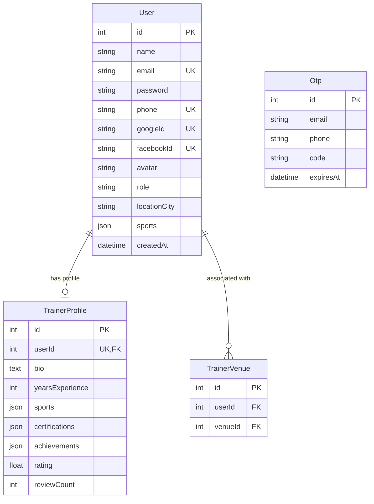
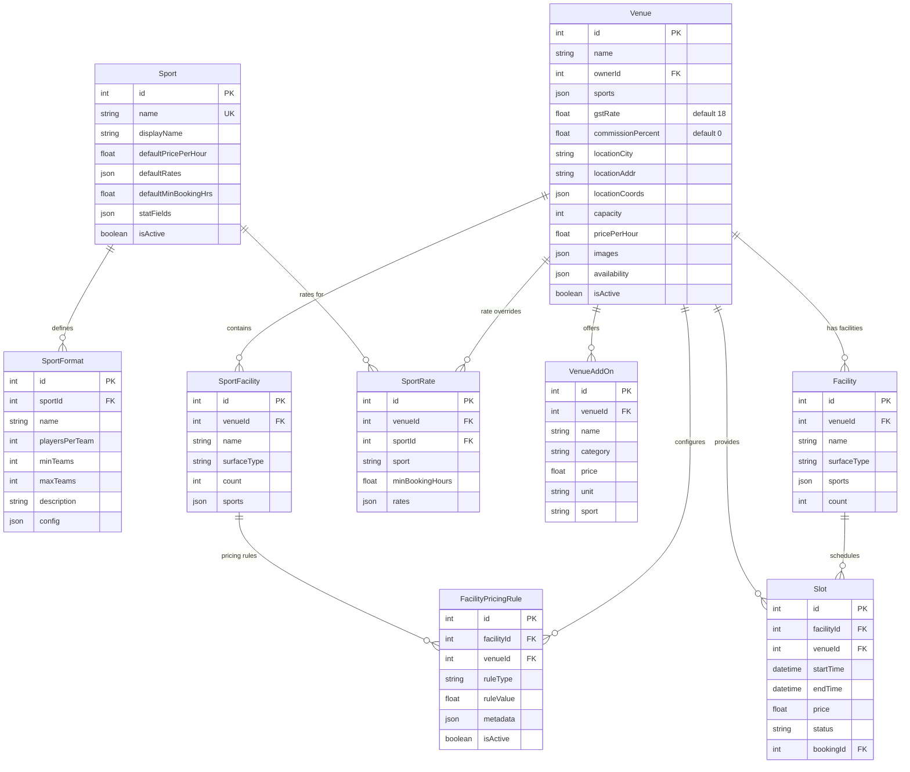
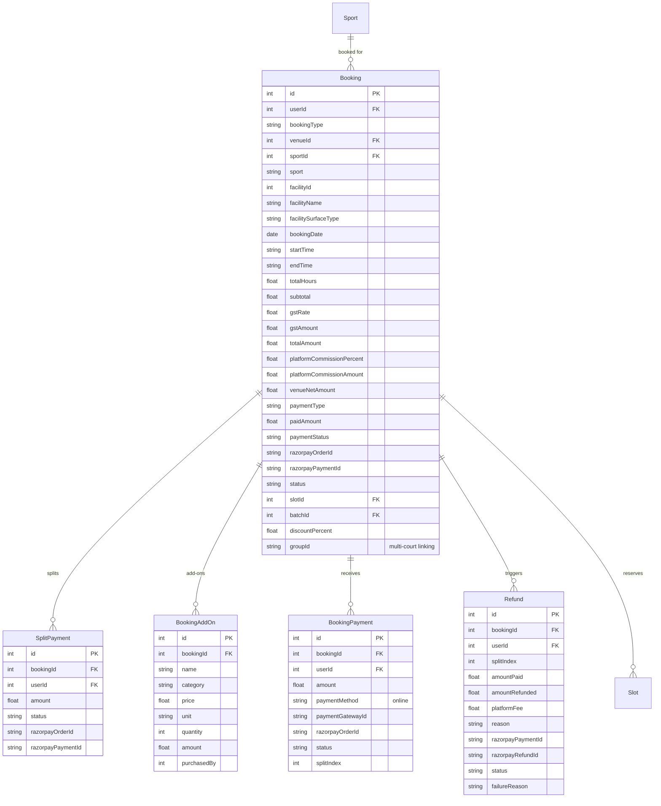
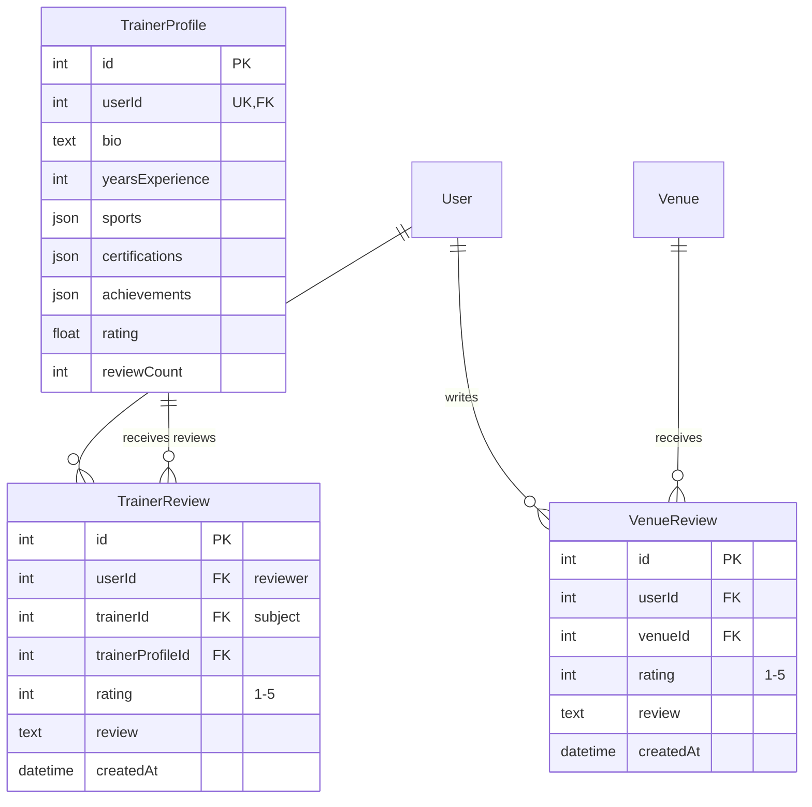
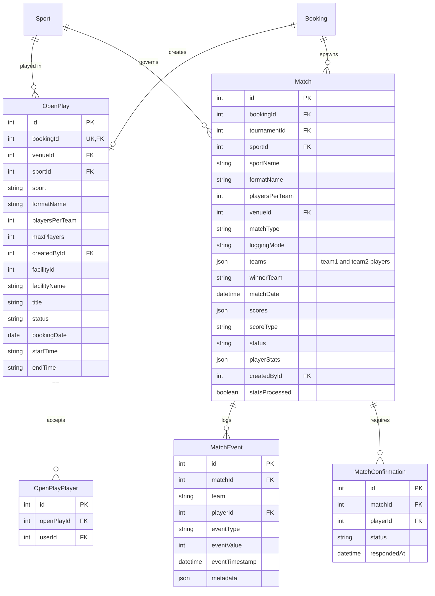
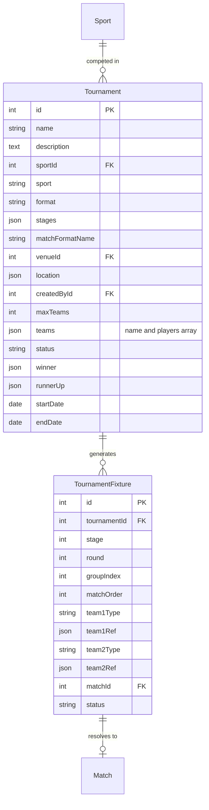
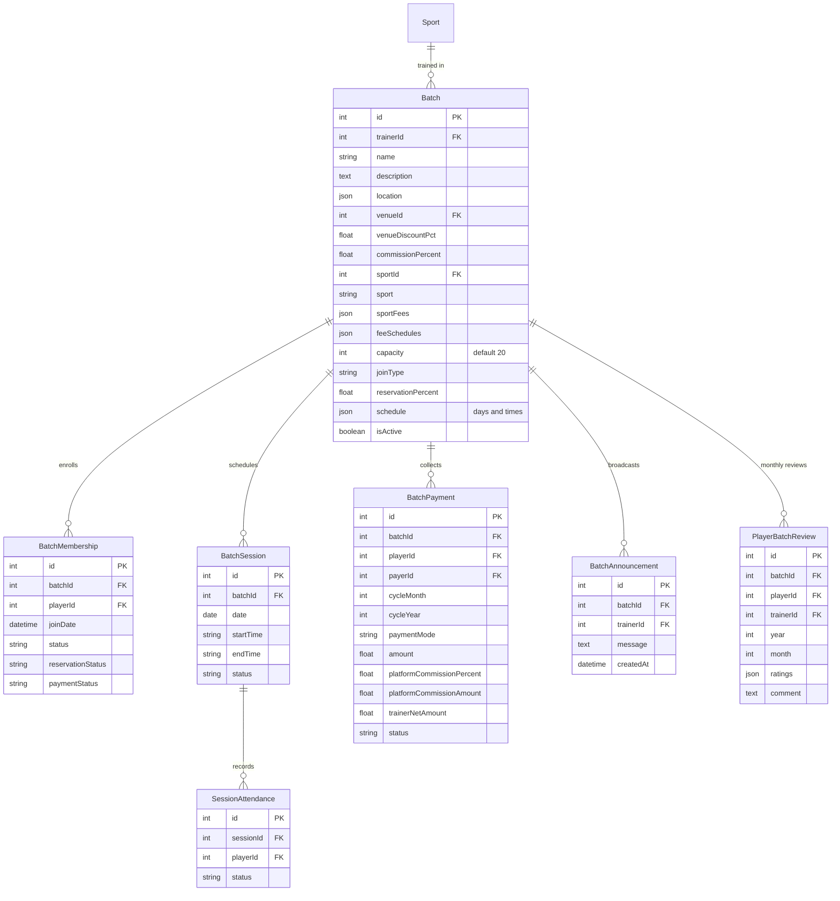
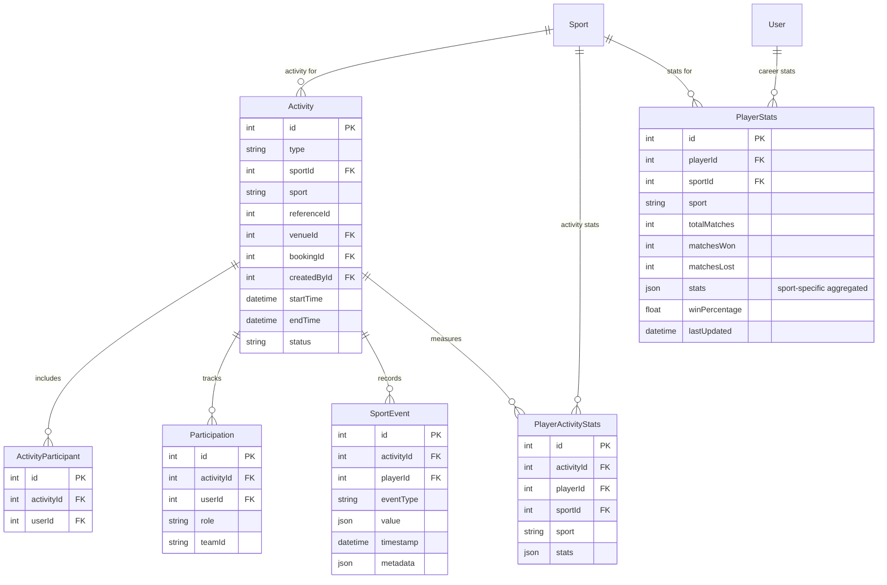
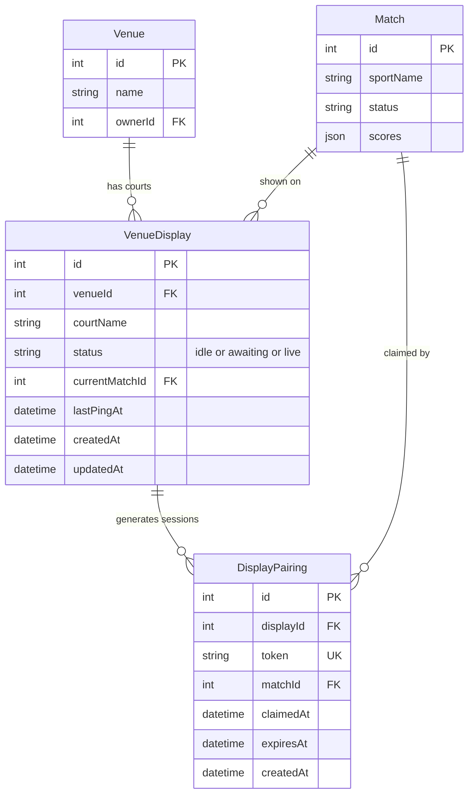

# Sportza — Data Model

**Version:** 3.3 | **Last updated:** Apr 28, 2026

---

## Database & ORM

- **Database:** MySQL
- **ORM:** Prisma
- **Schema location:** `apps/api/prisma/schema.prisma`

The schema is no longer MongoDB/Mongoose. All models use Prisma with MySQL (integer IDs, SQL tables).

---

## Model Overview (53 models)

| Category | Models |
|----------|--------|
| **Identity** | User, Otp, TrainerProfile, TrainerVenue, RefreshToken |
| **Infrastructure** | Sport, SportFormat, Venue, SportFacility, SportRate, VenueAddOn, Facility, Slot, FacilityPricingRule |
| **Reviews** | VenueReview, TrainerReview |
| **Marketplace** | Booking, SplitPayment, BookingAddOn, BookingPayment, Refund |
| **Open Play** | OpenPlay, OpenPlayPlayer |
| **Matches** | Match, MatchEvent, MatchConfirmation |
| **Tournaments** | Tournament, TournamentFixture |
| **Training** | Batch, BatchMembership, BatchSession, SessionAttendance, BatchPayment, BatchAnnouncement, PlayerBatchReview |
| **Stats / Analytics** | Activity, ActivityParticipant, Participation, SportEvent, PlayerActivityStats, PlayerStats |
| **Display / Scoreboard** | VenueDisplay, DisplayPairing |
| **Skill Rating** | SportSkillRating, RatingHistory |
| **Social / Network** | PlayerConnection, PeerPlayInvite |
| **Notifications** | Notification |

### Core ER Diagram (Primary Models)

```mermaid
erDiagram
    User {
        int id PK
        string name
        string email UK
        string phone UK
        string googleId UK
        string role
        string locationCity
        json sports
        datetime createdAt
    }

    Otp {
        int id PK
        string email
        string phone
        string code
        datetime expiresAt
    }

    TrainerProfile {
        int id PK
        int userId FK "unique"
        text bio
        int yearsExperience
        json sports
        json certifications
        json achievements
        float rating
        int reviewCount
    }

    TrainerVenue {
        int id PK
        int userId FK
        int venueId FK
    }

    Sport {
        int id PK
        string name UK
        string displayName
        float defaultPricePerHour
        json defaultRates
        float defaultMinBookingHrs
        json statFields
        boolean isActive
    }

    SportFormat {
        int id PK
        int sportId FK
        string name
        int playersPerTeam
        int minTeams
        int maxTeams
        string description
        json config
    }

    Venue {
        int id PK
        string name
        int ownerId FK
        json sports
        float gstRate
        float commissionPercent
        string locationCity
        string locationAddr
        json locationCoords
        int capacity
        float pricePerHour
        json images
        json availability
        boolean isActive
        datetime createdAt
    }

    SportFacility {
        int id PK
        int venueId FK
        string name
        string surfaceType
        int count
        json sports
    }

    SportRate {
        int id PK
        int venueId FK
        int sportId FK
        string sport
        float minBookingHours
        json rates
    }

    VenueAddOn {
        int id PK
        int venueId FK
        string name
        string category
        float price
        string unit
        string sport
    }

    Facility {
        int id PK
        int venueId FK
        string name
        string surfaceType
        json sports
        int count
    }

    Slot {
        int id PK
        int facilityId FK
        int venueId FK
        datetime startTime
        datetime endTime
        float price
        string status
        int bookingId FK
    }

    FacilityPricingRule {
        int id PK
        int facilityId FK
        int venueId FK
        string ruleType
        float ruleValue
        json metadata
        boolean isActive
    }

    VenueReview {
        int id PK
        int userId FK
        int venueId FK
        int rating
        text review
        datetime createdAt
    }

    TrainerReview {
        int id PK
        int userId FK
        int trainerId FK
        int trainerProfileId FK
        int rating
        text review
        datetime createdAt
    }

    Booking {
        int id PK
        int userId FK
        string bookingType
        int venueId FK
        int sportId FK
        string sport
        int facilityId
        string facilityName
        date bookingDate
        string startTime
        string endTime
        float totalHours
        float subtotal
        float gstRate
        float gstAmount
        float totalAmount
        float platformCommissionPercent
        float platformCommissionAmount
        float venueNetAmount
        string paymentType
        float paidAmount
        string paymentStatus
        string razorpayOrderId
        string razorpayPaymentId
        string status
        int slotId FK
        int batchId FK
        string groupId
    }

    SplitPayment {
        int id PK
        int bookingId FK
        int userId FK
        float amount
        string status
        string razorpayOrderId
        string razorpayPaymentId
    }

    BookingAddOn {
        int id PK
        int bookingId FK
        string name
        string category
        float price
        string unit
        int quantity
        float amount
        int purchasedBy
    }

    BookingPayment {
        int id PK
        int bookingId FK
        int userId FK
        float amount
        string paymentMethod
        string paymentGatewayId
        string razorpayOrderId
        string status
        int splitIndex
    }

    Refund {
        int id PK
        int bookingId FK
        int userId FK
        int splitIndex
        float amountPaid
        float amountRefunded
        float platformFee
        string reason
        string razorpayPaymentId
        string razorpayRefundId
        string status
        string failureReason
    }

    OpenPlay {
        int id PK
        int bookingId FK "unique"
        int venueId FK
        int sportId FK
        string sport
        string formatName
        int playersPerTeam
        int maxPlayers
        int createdById FK
        int facilityId
        string facilityName
        string title
        string status
        date bookingDate
        string startTime
        string endTime
    }

    OpenPlayPlayer {
        int id PK
        int openPlayId FK
        int userId FK
    }

    Match {
        int id PK
        int bookingId FK
        int tournamentId FK
        int sportId FK
        string sportName
        string formatName
        int playersPerTeam
        int venueId FK
        string matchType
        string loggingMode
        json teams
        string winnerTeam
        datetime matchDate
        json scores
        string scoreType
        string status
        json playerStats
        int createdById FK
        boolean statsProcessed
    }

    MatchEvent {
        int id PK
        int matchId FK
        string team
        int playerId FK
        string eventType
        int eventValue
        datetime eventTimestamp
        json metadata
    }

    MatchConfirmation {
        int id PK
        int matchId FK
        int playerId FK
        string status
        datetime respondedAt
    }

    Tournament {
        int id PK
        string name
        text description
        int sportId FK
        string sport
        string format
        json stages
        string matchFormatName
        int venueId FK
        json location
        int createdById FK
        int maxTeams
        json teams
        string status
        json winner
        json runnerUp
        date startDate
        date endDate
    }

    TournamentFixture {
        int id PK
        int tournamentId FK
        int stage
        int round
        int groupIndex
        int matchOrder
        string team1Type
        json team1Ref
        string team2Type
        json team2Ref
        int matchId FK
        string status
    }

    Batch {
        int id PK
        int trainerId FK
        string name
        text description
        json location
        int venueId FK
        float venueDiscountPct
        float commissionPercent
        int sportId FK
        string sport
        json sportFees
        json feeSchedules
        int capacity
        string joinType
        float reservationPercent
        json schedule
        boolean isActive
    }

    BatchMembership {
        int id PK
        int batchId FK
        int playerId FK
        datetime joinDate
        string status
        string reservationStatus
        string paymentStatus
    }

    BatchSession {
        int id PK
        int batchId FK
        date date
        string startTime
        string endTime
        string status
    }

    SessionAttendance {
        int id PK
        int sessionId FK
        int playerId FK
        string status
    }

    BatchPayment {
        int id PK
        int batchId FK
        int playerId FK
        int payerId FK
        int cycleMonth
        int cycleYear
        string paymentMode
        string validationStatus
        float amount
        float platformCommissionPercent
        float platformCommissionAmount
        float trainerNetAmount
        string status
    }

    BatchAnnouncement {
        int id PK
        int batchId FK
        int trainerId FK
        text message
        datetime createdAt
    }

    PlayerBatchReview {
        int id PK
        int batchId FK
        int playerId FK
        int trainerId FK
        int year
        int month
        json ratings
        text comment
    }

    Activity {
        int id PK
        string type
        int sportId FK
        string sport
        int referenceId
        int venueId FK
        int bookingId FK
        int createdById FK
        datetime startTime
        datetime endTime
        string status
    }

    ActivityParticipant {
        int id PK
        int activityId FK
        int userId FK
    }

    Participation {
        int id PK
        int activityId FK
        int userId FK
        string role
        string teamId
    }

    SportEvent {
        int id PK
        int activityId FK
        int playerId FK
        string eventType
        json value
        datetime timestamp
        json metadata
    }

    PlayerActivityStats {
        int id PK
        int activityId FK
        int playerId FK
        int sportId FK
        string sport
        json stats
    }

    PlayerStats {
        int id PK
        int playerId FK
        int sportId FK
        string sport
        int totalMatches
        int matchesWon
        int matchesLost
        json stats
        float winPercentage
        datetime lastUpdated
    }

    User ||--o| TrainerProfile : "has profile"
    User ||--o{ TrainerVenue : "trainer at"
    User ||--o{ Venue : owns
    User ||--o{ Booking : makes
    User ||--o{ SplitPayment : "split payer"
    User ||--o{ BookingPayment : pays
    User ||--o{ Refund : "refunded to"
    User ||--o{ VenueReview : "reviews venue"
    User ||--o{ TrainerReview : "reviews trainer"
    User ||--o{ OpenPlay : creates
    User ||--o{ OpenPlayPlayer : "joins play"
    User ||--o{ Match : "creates match"
    User ||--o{ MatchEvent : "logs event"
    User ||--o{ MatchConfirmation : confirms
    User ||--o{ Tournament : organizes
    User ||--o{ Batch : "trains as trainer"
    User ||--o{ BatchMembership : "joins batch"
    User ||--o{ BatchPayment : "pays or receives"
    User ||--o{ BatchAnnouncement : announces
    User ||--o{ PlayerBatchReview : "reviews player"
    User ||--o{ SessionAttendance : attends
    User ||--o{ PlayerStats : "career stats"
    User ||--o{ PlayerActivityStats : "activity stats"
    User ||--o{ Participation : participates
    User ||--o{ SportEvent : "sport events"
    User ||--o{ ActivityParticipant : "in activity"
    User ||--o{ Activity : "creates activity"

    Sport ||--o{ SportFormat : defines
    Sport ||--o{ Match : governs
    Sport ||--o{ Booking : "booked for"
    Sport ||--o{ OpenPlay : "played in"
    Sport ||--o{ Batch : "trained in"
    Sport ||--o{ Tournament : "competed in"
    Sport ||--o{ Activity : "activity for"
    Sport ||--o{ SportRate : "rates for"
    Sport ||--o{ PlayerStats : "stats for"
    Sport ||--o{ PlayerActivityStats : "activity stats"

    TrainerProfile ||--o{ TrainerReview : "receives reviews"

    Venue ||--o{ SportFacility : contains
    Venue ||--o{ SportRate : "rate overrides"
    Venue ||--o{ VenueAddOn : offers
    Venue ||--o{ Facility : "has facilities"
    Venue ||--o{ Slot : provides
    Venue ||--o{ FacilityPricingRule : configures
    Venue ||--o{ Booking : "bookings at"
    Venue ||--o{ OpenPlay : "open plays at"
    Venue ||--o{ Match : "matches at"
    Venue ||--o{ Batch : "batches at"
    Venue ||--o{ Tournament : "tournaments at"
    Venue ||--o{ VenueReview : reviewed
    Venue ||--o{ TrainerVenue : "trainers at"
    Venue ||--o{ Activity : "activities at"

    Facility ||--o{ Slot : schedules
    SportFacility ||--o{ FacilityPricingRule : "pricing rules"

    Booking ||--o{ SplitPayment : splits
    Booking ||--o{ BookingAddOn : "has add-ons"
    Booking ||--o{ BookingPayment : receives
    Booking ||--o{ Refund : triggers
    Booking ||--o{ Slot : reserves
    Booking ||--o| OpenPlay : "creates open play"
    Booking ||--o{ Match : spawns
    Booking ||--o{ Activity : "linked activity"

    OpenPlay ||--o{ OpenPlayPlayer : accepts

    Match ||--o{ MatchEvent : logs
    Match ||--o{ MatchConfirmation : requires
    Match ||--o{ TournamentFixture : "fixture link"

    Tournament ||--o{ TournamentFixture : generates
    Tournament ||--o{ Match : "tournament matches"

    Batch ||--o{ BatchMembership : enrolls
    Batch ||--o{ BatchSession : schedules
    Batch ||--o{ BatchPayment : collects
    Batch ||--o{ BatchAnnouncement : broadcasts
    Batch ||--o{ PlayerBatchReview : "monthly reviews"
    Batch ||--o{ Booking : "batch bookings"

    BatchSession ||--o{ SessionAttendance : records

    Activity ||--o{ ActivityParticipant : includes
    Activity ||--o{ Participation : tracks
    Activity ||--o{ SportEvent : records
    Activity ||--o{ PlayerActivityStats : measures

    VenueDisplay {
        int id PK
        int venueId FK
        string courtName
        string status
        int currentMatchId FK
        datetime lastPingAt
        datetime createdAt
        datetime updatedAt
    }

    DisplayPairing {
        int id PK
        int displayId FK
        string token UK
        int matchId FK
        datetime claimedAt
        datetime expiresAt
        datetime createdAt
    }

    Venue ||--o{ VenueDisplay : "has courts"
    VenueDisplay ||--o{ DisplayPairing : "generates sessions"
    Match ||--o{ VenueDisplay : "shown on"
    Match ||--o{ DisplayPairing : "claimed by"
```

---

### Domain-Specific Diagrams

The following diagrams break the full model into focused domains for easier reading.

### Identity & Infrastructure

### Marketplace (Booking & Payments)

### Reviews

### Open Play & Matches

### Tournaments

### Training Lifecycle

### Stats & Analytics

---

## Key Relations

| From | To | Relationship |
|------|-----|--------------|
| User | Venue | owns (ownerId) |
| User | Booking | makes (userId) |
| User | Batch | trains (trainerId) |
| Venue | SportFacility | has many |
| Venue | SportRate | has many (per-sport overrides) |
| Venue | Facility | has many (dbFacilities) |
| Venue | Slot | has many |
| Venue | VenueDisplay | has many courts |
| Facility | Slot | has many |
| Slot | Booking | optional 1:1 (bookingId) |
| Booking | OpenPlay | 0..1 (unique) |
| Booking | Match | has many |
| Booking | SplitPayment | has many |
| Booking | BookingPayment | has many |
| OpenPlay | OpenPlayPlayer | has many (join table) |
| Batch | BatchMembership | has many |
| Batch | BatchSession | has many |
| BatchSession | SessionAttendance | has many |
| Match | MatchEvent | has many |
| Match | MatchConfirmation | has many |
| Match | VenueDisplay | shown on (currentMatchId) |
| Match | DisplayPairing | claimed by (matchId) |
| VenueDisplay | DisplayPairing | has many sessions |
| Tournament | TournamentFixture | has many |
| TournamentFixture | Match | optional 0..1 |
| Activity | PlayerActivityStats | has many |
| User | PlayerStats | has many (per sport) |

---

## Key Indexes

| Model | Indexes |
|-------|---------|
| Otp | email, phone |
| Booking | venueId+facilityId+bookingDate+startTime+endTime+status, status+bookingDate, groupId |
| Slot | facilityId+startTime+endTime, venueId+startTime+endTime, status+startTime |
| FacilityPricingRule | facilityId+isActive, venueId |
| OpenPlay | venueId+bookingDate+status, sport+status, createdById |
| Match | sportId, sportName, status, matchDate, venueId, tournamentId, bookingId, createdById |
| MatchEvent | matchId, matchId+team, matchId+playerId, matchId+eventType |
| MatchConfirmation | matchId, playerId+status |
| TournamentFixture | tournamentId, tournamentId+stage |
| BatchMembership | batchId+playerId (unique), playerId, batchId+status |
| SessionAttendance | sessionId+playerId (unique), playerId |
| BatchPayment | batchId+playerId+cycleMonth+cycleYear |
| PlayerStats | playerId+sport (unique) |
| VenueReview | venueId+userId (unique), venueId |
| TrainerReview | trainerId+userId (unique), trainerId |
| VenueDisplay | venueId |
| DisplayPairing | token (unique), displayId |

---

## InstantBook & Slots

- **Slot** is the atomic reservable resource. Each slot has `facilityId`, `venueId`, `startTime`, `endTime`, `price`, `status`, and optional `bookingId`.
- **FacilityPricingRule** applies server-side pricing: `ruleType` (e.g. TIME_BASED, DAY_BASED, PEAK_HOUR), `ruleValue`, `metadata`.
- **API:** GET `/slots/venue/:venueId` for available slots; POST `/bookings/instant` for 3-tap instant book.

---

## Venue: facilities and pricing

- **SportFacility** — per-venue sport facilities (name, surfaceType, count, sports).
- **Facility** — separate entity for Slot linkage (venueId, name, surfaceType, sports, count).
- **SportRate** — per-sport rate overrides (venueId, sport, minBookingHours, rates JSON).
- **VenueAddOn** — add-ons (name, category, price, unit, sport?).
- **FacilityPricingRule** — pricing rules per facility (ruleType, ruleValue, metadata).

---

## Open Play

- **OpenPlay** — linked to one Booking (unique). `status`: open | full | cancelled | completed.
- **OpenPlayPlayer** — join table (openPlayId, userId). Replaces embedded players array.
- **T-30 confirmation:** Booking is confirmed only ~30 minutes before slot if open play is full and ≥50% paid. Should be a **BullMQ scheduled job** (not yet implemented in new monorepo).

---

## Match & Stats

- **Match** — sportId, sportName, formatName, teams (JSON), scores (JSON), scoreType, status, playerStats (JSON).
- **MatchEvent** — eventType, team, playerId, eventValue, eventTimestamp.
- **MatchConfirmation** — matchId, playerId, status (PENDING, CONFIRMED, DISPUTED).
- **PlayerStats** — playerId, sport, totalMatches, matchesWon, matchesLost, stats (JSON), winPercentage.
- **PlayerActivityStats** — raw per-activity stats; aggregates to PlayerStats.
- **Real-time scoring:** Socket.io room `match:<id>` broadcasts `match:score`, `match:event`, and `match:status` events to all subscribed clients (scoreboard page, scorer app).

---

## Training Lifecycle

- **Batch** — trainer, venue?, location?, sport, capacity, joinType, reservationPercent, schedule.
- **BatchMembership** — batch, player, status, reservationStatus, paymentStatus.
- **BatchSession** — batch, date, startTime, endTime, status.
- **SessionAttendance** — session, player, status (present|absent).
- **BatchPayment** — batch, player?, payer, cycleMonth, cycleYear, amount, platformCommissionPercent, trainerNetAmount.
- **PlayerBatchReview** — batch, player, trainer, year, month, ratings (JSON), comment.

---

## Display / Scoreboard (Venue Pairing)

### VenueDisplay — permanent court identity

| Field | Type | Notes |
|-------|------|-------|
| `id` | Int PK | Stable permanent id for this court |
| `venueId` | Int FK | Owner venue |
| `courtName` | String | e.g. "Court 1", "Turf A" |
| `status` | String | `idle` / `awaiting` / `live` |
| `currentMatchId` | Int? FK | Match currently shown on this display |
| `lastPingAt` | DateTime? | Last time the TV page was active |

### DisplayPairing — dynamic session token

| Field | Type | Notes |
|-------|------|-------|
| `id` | Int PK | |
| `displayId` | Int FK | Which court this session belongs to |
| `token` | String UK | 48-char hex, randomly generated per session |
| `matchId` | Int? FK | Filled when claimed (phone scans QR) |
| `claimedAt` | DateTime? | When the match was linked |
| `expiresAt` | DateTime | Default: 60 minutes from generation |

### Pairing flow

1. Venue owner generates a pairing session → fresh `DisplayPairing` row with a unique token.
2. TV browser opens `/display/pair/:token` — joins socket room `pairing:<token>`.
3. Phone user scans the QR → opens `/claim/:token` → selects a match → calls `POST /api/displays/claim/:token`.
4. Server marks `DisplayPairing.claimedAt`, sets `VenueDisplay.currentMatchId = matchId`, emits `display:paired` to the socket room.
5. TV navigates to `/scoreboard/:matchId` — no full page refresh loop required.

Old unclaimed pairings for the same court are immediately expired when a new one is generated.

---

## Skill Rating Models (Added Apr 2026)

### SportSkillRating — per-user per-sport ELO record

| Field | Type | Notes |
|-------|------|-------|
| `id` | Int PK | |
| `userId` | Int FK | Owner player |
| `sportId` | Int FK | Sport |
| `formatName` | String | e.g. "Singles", "Doubles", "T20" |
| `rating` | Float | Current ELO rating; starts at 1000 |
| `matchesPlayed` | Int | Total ranked matches |
| `winsCount` | Int | Total wins (for confidence tier) |
| `totalMOVSum` | Float | Cumulative MOV for analytics |
| `confidence` | String | `provisional` / `regular` / `established` |
| `updatedAt` | DateTime | Last rating change |

**Unique constraint:** `(userId, sportId, formatName)` — one record per player-sport-format combination.

**Confidence tiers:**
- `provisional`: 0–9 matches → K-factor multiplier 1.5×
- `regular`: 10–29 matches → 1.0×
- `established`: 30+ matches → 0.7×

### RatingHistory — audit log of every rating change

| Field | Type | Notes |
|-------|------|-------|
| `id` | Int PK | |
| `userId` | Int FK | Player |
| `sportId` | Int FK | Sport |
| `formatName` | String | Format |
| `oldRating` | Float | Rating before this event |
| `newRating` | Float | Rating after this event |
| `delta` | Float | newRating − oldRating (signed) |
| `activityId` | Int? | FK to match/open-play/batch activity that triggered the change (nullable for drift events) |
| `reason` | String? | e.g. `"match_result"`, `"monthly_drift"` |
| `createdAt` | DateTime | When the change was applied |

---

## Social / Network Models (Added Apr 2026)

### PlayerConnection — bidirectional social graph edge

| Field | Type | Notes |
|-------|------|-------|
| `id` | Int PK | |
| `userId` | Int FK | Lower of the two player IDs (always) |
| `connectedUserId` | Int FK | Higher of the two player IDs |
| `connectionType` | String | `match` / `open_play` / `venue` |
| `venueId` | Int? FK | Anchor venue for venue-type connections |
| `playCount` | Int | Number of shared activities; incremented on each interaction |
| `lastActivityAt` | DateTime | Most recent shared activity timestamp |
| `createdAt` | DateTime | First interaction date |

**Business rule:** `userId` always stores the lower integer of the pair — enforced in the `upsertConnection` service function — so that each player pair has exactly one row and queries can use equality rather than OR conditions.

### PeerPlayInvite — structured peer-to-peer play invitation

| Field | Type | Notes |
|-------|------|-------|
| `id` | Int PK | |
| `senderId` | Int FK | Player who sent the invite |
| `receiverId` | Int FK | Player who received the invite |
| `sportId` | Int FK | Sport the invite is for |
| `sport` | String | Denormalised sport name for display |
| `message` | String? | Optional message (≤1000 chars) |
| `proposedDate` | String? | `YYYY-MM-DD` |
| `proposedStartTime` | String? | `HH:MM` |
| `proposedEndTime` | String? | `HH:MM` |
| `status` | String | `pending` / `accepted` / `declined` / `cancelled` / `expired` |
| `respondedAt` | DateTime? | When receiver accepted or declined |
| `createdAt` | DateTime | |

**Unique constraint:** One `pending` invite per `(senderId, receiverId, sportId)` combination.  
**State rules:** Only sender can `cancel`; only receiver can `accept` / `decline`.

---

## Notification Model (Added Apr 2026)

### Notification — in-app notification item

| Field | Type | Notes |
|-------|------|-------|
| `id` | Int PK | |
| `userId` | Int FK | Target user |
| `type` | String | e.g. `peer_invite_received`, `booking_confirmed`, `rating_updated` |
| `title` | String | Short title for list view |
| `body` | String | Full notification body text |
| `data` | Json? | Metadata blob for deep linking (e.g. `{ inviteId: 42 }`) |
| `isRead` | Boolean | Default `false` |
| `readAt` | DateTime? | When `isRead` was set to `true` |
| `createdAt` | DateTime | |

---

## Auth Model (Added Apr 2026)

### RefreshToken — JWT refresh token store

| Field | Type | Notes |
|-------|------|-------|
| `id` | Int PK | |
| `userId` | Int FK | Token owner |
| `token` | String UK | Hashed token value (SHA-256) |
| `expiresAt` | DateTime | 7 days from issuance |
| `revokedAt` | DateTime? | Set on logout or password reset |
| `userAgent` | String? | Client user-agent for session visibility |
| `ipAddress` | String? | Client IP for session visibility |
| `createdAt` | DateTime | |

**Rotation policy:** Each use of a refresh token issues a new one and immediately revokes the old one, minimising the replay window.

---

## References

- **Schema file:** `apps/api/prisma/schema.prisma`
- **Rating system:** `docs/RATING_SYSTEM.md`
- **Document index:** `docs/TRACEABILITY.md`
- **Sponsor monetization:** `docs/SPONSOR_MONETIZATION_MODULE.md`
