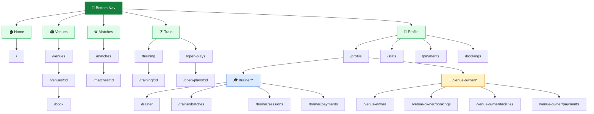

# App Navigation Specification

**Version:** 3.0  
**Last updated:** Mar 2026

This document defines the navigation philosophy, primary and secondary patterns, and the full app navigation map for the Sportza Turborepo monorepo. It is the source of truth for UX and routing.

**Frontend stack:** React 18 + Vite + Tailwind + React Router v6 + Auth0 + TanStack Query  
**Layouts:** MainLayout (with BottomNav), AuthLayout  
**Auth:** AuthGuard component for protected routes

---

## 1. Navigation Philosophy

**Primary rule**

- **Booking** = core revenue.
- **Open Play + Stats** = retention.

Navigation must reflect that priority: booking is the main path; Open Play and Stats keep users engaged.

---

## 2. Primary Navigation — Single Bottom Nav

We use a **5-tab Bottom Navigation** shared across all roles. Role-specific content is accessed via routes, not by switching the nav.

| Tab        | Purpose                          |
|-----------|-----------------------------------|
| **Home**  | Discovery, featured venues, next game, leaderboard preview |
| **Venues** | Browse venues, venue detail, book |
| **Matches** | My matches, match detail, live scoring |
| **Train** | Training sessions, batches, open plays |
| **Profile** | Account, settings, role-specific dashboards |

**Note:** The old role-switching bottom nav (different tabs per Player/Trainer/Venue Owner) has been replaced by a **single nav** with role-specific routes. All users see Home, Venues, Matches, Train, Profile; trainers and venue owners access their dashboards via Profile or direct routes under `/trainer/*` and `/venue-owner/*`.

---

## 3. Full Route Map (Grouped by Domain)

### Public routes (no auth)

| Route | Description |
|-------|-------------|
| `/` | Home (discovery, featured) |
| `/venues` | Venue list |
| `/venues/:id` | Venue detail |
| `/training` | Training sessions list |
| `/training/:id` | Training session detail |
| `/open-plays` | Open plays discovery |
| `/open-plays/:id` | Open play detail |
| `/tournaments` | Tournaments list |
| `/tournaments/:id` | Tournament detail |
| `/leaderboard` | Leaderboard |

### Auth routes (login/register)

| Route | Description |
|-------|-------------|
| `/login` | Login (Auth0) |
| `/register` | Register (Auth0) |

**Auth flow:** Auth0 integration with **Google SSO**, **Email OTP**, and **Magic Link**. Users authenticate via Auth0; no in-app password storage for SSO/OTP/Magic Link flows.

### Protected routes (AuthGuard)

| Route | Description |
|-------|-------------|
| `/book` | Instant book flow |
| `/bookings` | My bookings |
| `/bookings/:id` | Booking detail |
| `/matches` | My matches |
| `/matches/:id` | Match detail |
| `/open-plays/create` | Create open play |
| `/open-plays/:id/manage` | Manage open play |
| `/tournaments/create` | Create tournament |
| `/stats` | My stats overview |
| `/stats/analytics` | Analytics |
| `/stats/sport/:sport` | Sport-specific stats |
| `/stats/match/:matchId` | Match stats |
| `/profile` | User profile |
| `/payments` | Payment history |
| `/payments/receipt/:id` | Receipt detail |

### Trainer routes (AuthGuard + trainer role)

| Route | Description |
|-------|-------------|
| `/trainer` | Trainer dashboard |
| `/trainer/sessions` | Trainer sessions |
| `/trainer/payments` | Trainer payments |
| `/trainer/reviews` | Trainer reviews |
| `/trainer/batches` | Batches list |
| `/trainer/batches/create` | Create batch |
| `/trainer/batches/:id` | Batch detail |

### Venue Owner routes (AuthGuard + venue_owner role)

| Route | Description |
|-------|-------------|
| `/venue-owner` | Venue owner dashboard |
| `/venue-owner/bookings` | Venue bookings |
| `/venue-owner/facilities` | Manage facilities |
| `/venue-owner/payments` | Venue payments |

---

## 4. Role-Based Access

| Role | Access |
|------|--------|
| **player** | All public + protected routes (bookings, matches, stats, profile, payments) |
| **trainer** | Player routes + `/trainer/*` |
| **venue_owner** | Player routes + `/venue-owner/*` |

All roles use the **same 5-tab BottomNav**. Role-specific content is reached via routes (e.g. Profile → link to Trainer Dashboard → `/trainer`), not by switching nav tabs.

---

## 5. Auth Flow (Auth0)

- **Google SSO** — Social login via Auth0
- **Email OTP** — One-time password sent to email
- **Magic Link** — Passwordless login via email link

Auth0 handles token refresh, session management, and logout. The frontend uses AuthGuard to wrap protected routes and redirect unauthenticated users to `/login`.

---

## 6. Frontend Structure

- **38 pages** in `apps/web/src/pages/`
- **MainLayout** — Wraps authenticated app; includes BottomNav
- **AuthLayout** — Wraps login/register (no BottomNav)
- **AuthGuard** — Protects routes; redirects to `/login` when unauthenticated

---

## 7. Secondary Navigation Patterns

### Stack navigation

- **Used for:** Venue → Slots → Confirm & Pay; Open Play → Join; Tournament → Fixture → Match
- **Behavior:** Back button; tab does not change
- **Rule:** No deep nesting beyond 4 levels

### Modal navigation

- **Used for:** Filters, add-ons, sport select, split payment
- **Behavior:** Slide-up modal; dismiss by backdrop or close

### Full-screen flow (hide BottomNav)

- **Used for:** Payment, Live Match, Create Tournament
- **Behavior:** BottomNav hidden for duration of flow

---

## 8. UX Behavior Rules

1. **Never more than 3 taps to book** (from Home to confirmation)
2. **Back** always returns logically
3. **No deep nesting** beyond 4 levels
4. **Stats** accessible in 1 tap (Train tab or direct route)

---

## 9. References

- **Booking flow:** `docs/BOOKING_FLOW_UX.md`
- **Payment:** `docs/PAYMENT_GATEWAY_ARCHITECTURE.md`
- **Document index:** `docs/TRACEABILITY.md`
