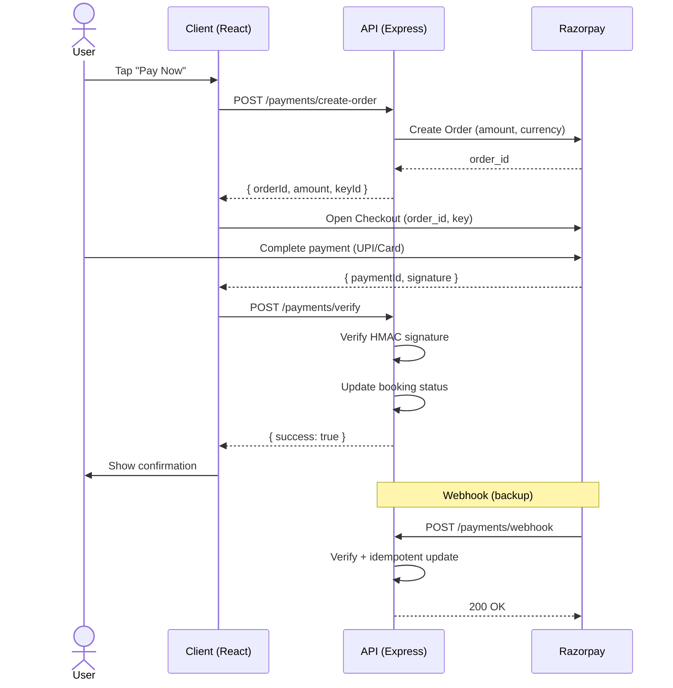

# Payment Gateway Architecture

## Sportza — Payment Gateway

**Version:** 2.1  
**Last updated:** Apr 2026

---

## 1. Overview

The platform uses **Razorpay** as the single payment gateway for all monetary transactions. All payments are in **INR**. The architecture supports:

- **Booking payments** — Full (single payer) or split (each participant pays their share).
- **Batch fee payments** — Trainer batch enrollments (separate API; same gateway pattern).
- **Multiple payment methods** — UPI, Card (credit/debit), Net Banking, and Wallet, presented via **Razorpay Checkout**.

The client does **not** handle card or UPI details; Razorpay Checkout provides a secure, PCI-compliant payment UI. Our backend creates **orders** via the Razorpay Orders API and **verifies** payment signatures after success.

---

## 2. Payment Methods Supported

| Method        | Description | How it appears |
|---------------|-------------|----------------|
| **UPI**       | GPay, PhonePe, Paytm, BHIM, and other UPI apps | User selects UPI in our Payment screen; Checkout opens with UPI pre-selected (when `preferred_method: 'upi'` is passed). |
| **Card**      | Credit and debit cards (Visa, Mastercard, RuPay, etc.) | User selects Card; Checkout shows card form or pre-selects card tab. |
| **Net Banking** | All supported banks via Razorpay | User selects Net Banking; Checkout shows bank list. |
| **Wallet**    | Paytm Wallet, Mobikwik, etc. (when enabled in Razorpay Dashboard) | Optional; can be passed as `preferred_method: 'wallet'` for Checkout. |

Merchant must **enable** the desired methods (UPI, cards, net banking, wallet) in the [Razorpay Dashboard](https://dashboard.razorpay.com/) under **Settings → Configuration → Payment Methods**. Our app sends an optional **preferred method** when creating an order so that Razorpay Checkout can open with the correct tab selected.

---

## 3. High-Level Architecture

```
┌─────────────────────────────────────────────────────────────────────────────────┐
│                           PAYMENT GATEWAY ARCHITECTURE                            │
├─────────────────────────────────────────────────────────────────────────────────┤
│                                                                                   │
│   ┌──────────────┐     ┌─────────────────────┐     ┌─────────────────────────┐ │
│   │   User /     │     │   Our Platform       │     │   Razorpay              │ │
│   │   Client     │────▶│   API (Node/Express)  │────▶│   (Orders + Checkout)   │ │
│   │   (React)    │     │   Create Order       │     │   Payment processing    │ │
│   │              │◀────│   Verify Payment     │◀────│   UPI / Card / NetBank  │ │
│   └──────────────┘     └─────────────────────┘     └────────────┬────────────┘ │
│          │                          │                            │              │
│          │  Payment method          │  orderId, amount,           │              │
│          │  (UPI / Card /          │  keyId, preferredMethod     │              │
│          │   Net Banking / Wallet)  │                            │              │
│          │                          │                            ▼              │
│          │                          │                 ┌──────────────────────┐  │
│          └──────────────────────────┴────────────────▶│  Payment methods     │  │
│             Opens Razorpay Checkout with preferredMethod │  UPI · Card · Bank · Wallet │
│                                                        └──────────────────────┘  │
└─────────────────────────────────────────────────────────────────────────────────┘
```

- **Client:** Renders Payment screen with method selector (UPI, Card, Net Banking). On "Pay Now", calls our API to create an order (with optional `method`), then opens Razorpay Checkout with `orderId`, `keyId`, and optional `method` so the correct tab is pre-selected.
- **Our API:** Creates order via Razorpay Orders API (amount in paise, currency INR, notes for bookingId/userId/splitIndex and preferred_method). Stores `razorpayOrderId` on booking (or on split payment). After user pays, client sends payment details to our **verify** endpoint; we verify signature and update booking/split status.
- **Razorpay:** Hosts Checkout UI; routes payment to UPI/card/net banking/wallet; returns payment id and signature to client; we verify server-side.

---

## 4. Payment Flow (Sequence)

1. **User** selects payment method (UPI / Card / Net Banking) on Payment screen and taps **Pay Now**.
2. **Client** calls `POST /api/payments/create-order` with `{ bookingId, method? }` (and for split: `splitIndex` or `forUser`).
3. **Our API** validates booking, computes amount (full or one split share), creates Razorpay order with `notes.preferred_method` when `method` is provided, saves `razorpayOrderId` on booking, returns `{ orderId, amount, currency, keyId, preferredMethod }`.
4. **Client** opens **Razorpay Checkout** (checkout.js) with `order_id`, `key`, and `options.method` = `preferredMethod` (e.g. `'upi'`) so the correct payment method is pre-selected.
5. **User** completes payment on Razorpay (UPI app / card / bank).
6. **Razorpay** returns payment id and signature to the client.
7. **Client** calls `POST /api/payments/verify` with `{ orderId, paymentId, signature, bookingId, splitIndex? }`.
8. **Our API** verifies signature using `RAZORPAY_KEY_SECRET`, then updates booking `paymentStatus` (or the relevant `splitPayments[].status`) to `'paid'`, and stores `razorpayPaymentId`. Responds success/failure.
9. **Client** shows confirmation and navigates to confirmation screen (or payment history).



---

## 5. API Summary

| Endpoint | Method | Purpose |
|----------|--------|---------|
| `/api/payments/create-order` | POST | Create Razorpay order for full or one split share; body: `bookingId`, optional `method` (upi \| card \| netbanking \| wallet), optional `splitIndex` / `forUser`. Returns `orderId`, `amount`, `currency`, `keyId`, `preferredMethod`. |
| `/api/payments/verify` | POST | Verify payment signature and update booking/split status; body: `orderId`, `paymentId`, `signature`, `bookingId`, optional `splitIndex`. **Idempotent:** if already paid with this `paymentId`, returns success without re-applying. |
| `/api/payments/webhook` | POST | Razorpay server-to-server: receives `payment.captured` and other events. **No auth;** signature verified with `RAZORPAY_WEBHOOK_SECRET`. Raw body required for signature verification. Updates booking/split when payment is captured (same logic as verify). |
| `/api/payments/booking/:bookingId` | GET | Get payment status for a booking (full or per split). |

---

## 6. Server-side payment confirmation (webhook)

Razorpay can send **webhooks** when a payment is captured (or other events). This gives **server-side confirmation** even if the client never calls `/verify` (e.g. user closed the app, network failed).

1. **Configure in Razorpay Dashboard:** Settings → Webhooks → Add new webhook. URL: `https://your-api-domain.com/api/payments/webhook`. Select event **payment.captured**. Copy the **webhook secret** and set `RAZORPAY_WEBHOOK_SECRET` in your environment.
2. **Our endpoint:** `POST /api/payments/webhook` receives the raw JSON body. Signature is verified with `HMAC-SHA256(RAZORPAY_WEBHOOK_SECRET, rawBody)`; header `x-razorpay-signature` must match. If invalid, respond 400.
3. **On `payment.captured`:** We read `payload.payment.entity` (id, order_id, notes). We find the booking by `notes.bookingId` or by `razorpayOrderId` / `splitPayments.razorpayOrderId`. We then apply the same update as `/verify` (mark paid, run conflict resolution). **Idempotent:** if the booking/split is already paid with this payment id, we do nothing and return 200.
4. **Other events:** We respond 200 without updating (so Razorpay does not retry).

---

## 7. Security and Compliance

- **PCI DSS:** Card and UPI details are never sent to our servers; Razorpay Checkout is PCI-compliant.
- **Secrets:** `RAZORPAY_KEY_ID` (public, for Checkout), `RAZORPAY_KEY_SECRET` (server-only, for order creation and client verify signature), `RAZORPAY_WEBHOOK_SECRET` (server-only, for webhook signature verification; from Razorpay Dashboard when creating the webhook).
- **Verification:** Payment is considered successful only after server-side signature verification (client verify or webhook); client payload alone is not trusted.
- **Idempotency:** Both `/verify` and the webhook handler are idempotent: if the booking (or split) is already marked paid with the same `razorpayPaymentId`, we return success without re-applying or double-triggering conflict/refunds.

---

## 8. Batch Fee Payments

Batch fee payments (trainer enrollments) follow the same Razorpay gateway pattern:

- `POST /api/batches/:id/payments` — records a batch fee payment; creates a `BatchPayment` row with `platformCommissionAmount` and `trainerNetAmount` computed from `Batch.commissionPercent`
- Payment methods and verification flow identical to booking payments
- `BatchPayment.validationStatus` tracks whether the offline/online payment has been confirmed by the trainer

See `docs/DATA_MODEL.md` — BatchPayment model for field reference.

---

## 9. Related Documents

- **Document index & traceability:** `docs/TRACEABILITY.md`
- **FRD** — FR-PAY-1, FR-PAY-2, FR-PAY-3, FR-PAY-4 (payment methods, UPI, refunds).
- **TSD** — Technology stack, Integration (Razorpay), Deployment.
- **Booking State & Flows** — Payment-priority confirmation, refund rules (manual 95%, conflict 100%).
- **Data Model** — Booking `paymentStatus`, `razorpayOrderId`, `razorpayPaymentId`; BatchPayment; Refund entity.
- **Change Log:** `docs/CHANGE_LOG_LAST_30_DAYS.md` — CL-002 (commission system), CL-010 (cloudflared webhook testing)
