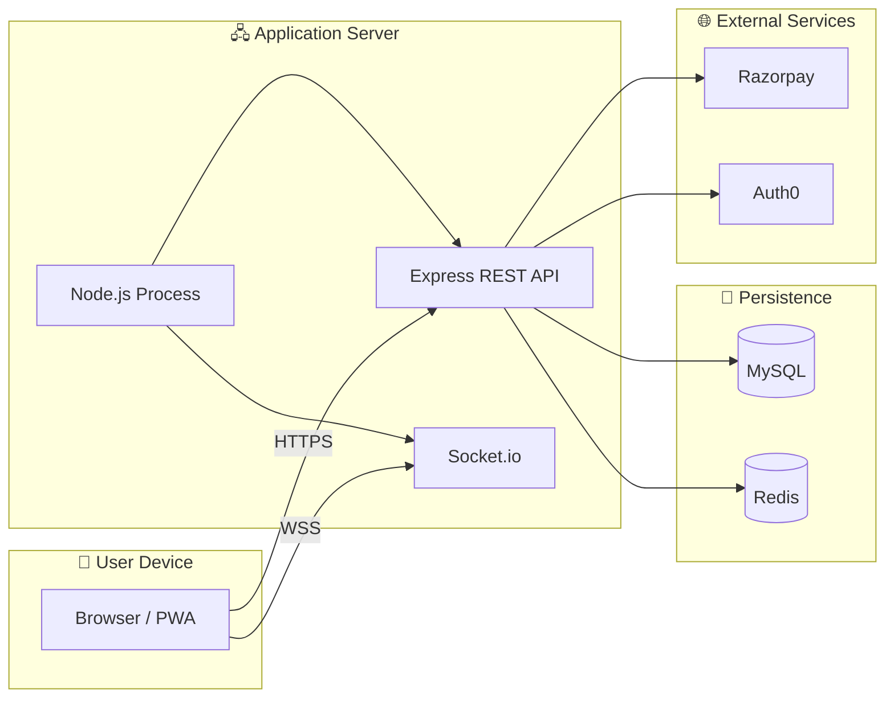

# Technical Specification Document

## Sportza — Technical Specification

**Version:** 1.4  
**Last updated:** Apr 2026

---

## Table of Contents

1. Document Control
2. Purpose of the Document
3. Scope Overview  
   - 3.1 In-Scope  
   - 3.2 Out-of-Scope
4. System Overview  
   - 4.1 Business Context  
   - 4.2 High-Level System Capabilities
5. Architecture Overview  
   - 5.1 Logical Architecture  
   - 5.2 Physical Architecture
6. Technology Stack
7. Data Architecture  
   - 7.1 Data Model Overview  
   - 7.2 Key Entities  
   - 7.3 Data Versioning & Audit
8. Functional Component Design  
   - 8.1 Components
9. Calculation & Rule Engine  
   - 9.1 Calculation Flow  
   - 9.2 Key Formulas  
   - 9.3 Validation Rules
10. User Management & Security  
    - 10.1 Authentication & Authorization  
    - 10.2 Data Security
11. Integration Specifications
12. Deployment & Release Management
13. Risks & Mitigations
14. Sign-Off

---

## 1. Document Control

| Item | Details |
|------|---------|
| **Document title** | Technical Specification Document — Sportza |
| **Version** | 1.4 |
| **Date** | Apr 2026 |
| **Author** | — |
| **Related documents** | **Traceability** (docs/TRACEABILITY.md); BRD; FRD; Data Model; Booking State & Flows; Booking Flow UX; Navigation; Payment Gateway Architecture |
| **Change log** | v1.0 — Initial TSD. v1.1 — Payment gateway §5.3; refunds (Refund model, service); booking states; open play no auto-cancel; traceability. v1.2 — Trainer Mode backend (TrainerProfile, BatchAnnouncement, trainerService, session/attendance/announcement APIs), tournament standings API, training explore API, Docker deployment. v1.3 — Turborepo monorepo; apps/web (Vite, Tailwind, Auth0, TanStack Query, React Hook Form + Zod, Razorpay Web SDK); apps/api (Prisma/MySQL, Auth0 JWT, Zod, ioredis, BullMQ, OpenAPI, Nodemailer, Multer+S3); packages/tokens, packages/ui, packages/api-client; Docker Compose (MySQL, Redis, API, Web). |

---

## 2. Purpose of the Document

This Technical Specification Document (TSD) describes the **technical design** of **Sportza** (sports venue booking & tournament platform). It is intended for:

- **Development teams** implementing the system (backend API, frontend app, real-time scoring).
- **Architects and reviewers** validating technology choices, data model, and integration approach.
- **QA and DevOps** for test strategy, deployment, and environment configuration.

The TSD bridges **business and functional requirements** (BRD, FRD) with **implementation**: architecture, technology stack, data model, calculation and validation rules, security, integrations, and deployment. It does not replace the BRD or FRD; it references them and adds technical detail.

---

## 3. Scope Overview

### 3.1 In-Scope

- **Web application (React)** — Mobile-first UI for players, venue owners, trainers; bottom nav (Home | Bookings | Open Play | Stats | Profile); booking flow, open play, stats, leaderboard, venue/trainer discovery, ratings & reviews.
- **REST API (Node.js/Express)** — Auth, sports, venues, bookings, payments, open plays, matches, tournaments, batches, trainers, stats, reports.
- **Real-time scoring** — Socket.io for live match score updates (room per match).
- **Payment integration** — Razorpay for full and split payments; commission and net amounts computed per booking and batch payment.
- **Data persistence** — MySQL (Prisma ORM) for all entities; booking state logic (T-30, ≥50% rule); monthly reports for venue, trainer, and platform.
- **Authentication** — Auth0 (Google SSO, Email OTP via Redis, Magic Link); role-based access (player, venue_owner, trainer, admin).
- **Booking state engine** — T-30 checkpoint for split and open play; immediate confirmation for solo and batch; status matrix (Pending, Confirmed, Fully Paid, Cancelled, Completed).
- **Scheduled jobs** — Open-play confirmation at T-30 (full + ≥50% paid); optional split-only T-30 processor.

### 3.2 Out-of-Scope

- Native iOS/Android apps (current scope is responsive web; API supports future native clients).
- Detailed NFR document (performance targets, SLA) as a separate deliverable.
- Deep UI/UX specifications (covered in BOOKING_FLOW_UX.md, NAVIGATION.md, and design assets).
- Third-party venue management systems integration (no PMS/Channel Manager in MVP).
- Automated payout execution to venues/trainers (reports and settlement data only; payouts manual or future phase).

---

## 4. System Overview

### 4.1 Business Context

The platform serves:

- **Players** — Discover venues, trainers, batches; book slots (solo or split); join open plays; play matches and tournaments; track stats and monthly trainer reviews; post venue/trainer reviews (trainer review after ≥1 month in batch).
- **Venue owners** — List venues with multi-facility, per-sport and time-slot pricing (including weekday/weekend); add-ons; commission % at onboarding; view bookings and monthly venue net + platform commission reports.
- **Trainers** — Create and manage batches; manage players and sessions; mark attendance; record payments; post announcements; maintain extended trainer profile (bio, certifications, achievements); view dashboard and settlement reports.
- **Admin** — Manage sports, venues, users; access platform monthly commission reports.

Revenue model: platform commission % on venue bookings (on base amount only; add-ons not subject to commission) and on batch fee payments; settled month-wise with transparency for all parties.

### 4.2 High-Level System Capabilities

| Capability | Description |
|------------|-------------|
| **Venue & facility management** | Multi-facility venues; facilities can support multiple sports; per-sport, time-slot, and weekday/weekend pricing; GST; min booking duration per venue/sport; add-ons (beverage, equipment_rent, eatable, other). |
| **Booking & payments** | Create booking with facilityId/facilityName (required), sport, date, time; full or split payment; add-on purchases attributed to purchaser (split: added to purchaser’s share); Razorpay; commission and venue net calculated at booking create (add-ons increase total and venue net only). |
| **Booking state logic** | Solo/batch: immediate confirmation. Split/open play: T-30 checkpoint; ≥50% paid at T-30 → Confirmed; &lt;50% → Cancelled. Status: Pending, Confirmed, Fully Paid, Cancelled, Completed. |
| **Open play** | Create from booking; others join until full; at T-30: full + ≥50% paid → confirm booking; else cancel. |
| **Matches & scoring** | Create from booking or tournament fixture; score types: simple, cricket, tennis, padel, pickleball_rally, pickleball_service; real-time via Socket.io; complete match → aggregate player stats. |
| **Tournaments** | Create (venue or any location); register teams; generate fixtures (knockout, round_robin, etc.); create matches from slots; format-specific standings (points table, bracket, group standings); tournament list/detail with discoverability. |
| **Batches** | Trainer batches; optional venue or custom location; sport, days, time, fee schedules; batch fee payments with platform commission and trainer net; discovery and join; monthly player reviews (sport + cognitive). |
| **Trainer Mode** | Dashboard (aggregated metrics), session management (auto-generation, status updates), attendance tracking (per-session checkboxes), batch announcements, trainer profile (bio, certifications, achievements), settlement reports. |
| **Training Explore** | Player-facing API for discovering active training batches with trainer profiles, ratings, filters by sport/location/skill level. |
| **Discovery & ratings** | Venues/trainers/batches by sport, city; venue and trainer average rating and review count; venue reviews anytime; trainer review only after ≥1 month in batch. |
| **Player stats** | Per-sport stats and leaderboards from completed matches; monthly batch progress (trainer reviews). |
| **Monetization & reports** | Per-booking and per–batch payment commission; monthly reports: venue net, trainer net, platform commission; optional breakdown by venue/trainer. |

---

## 5. Architecture Overview

### 5.1 Logical Architecture

The following diagram shows the logical layers and their responsibilities. Data flows from the client through the API and business layer to the database; real-time updates flow back via WebSocket.

```mermaid
flowchart TB
    subgraph Client["🖥️ Client Layer (React SPA)"]
        direction TB
        A[Auth: Auth0 (Google SSO, Email OTP, Magic Link)]
        B[Home · Venues · Matches · Train · Profile]
        C[Booking Flow: Venue → Slot → Summary → Payment]
        D[Venue / Trainer Discovery & Reviews]
        E[Match List & Live Match UI]
        F[Socket.io Client]
    end

    subgraph API["⚙️ API Layer (Node.js / Express)"]
        direction TB
        G[REST: /api/auth, venues, bookings, payments, open-plays, matches, stats, tournaments, batches, trainers, reports]
        H[Auth0 JWT Middleware & Role Checks]
        I[Socket.io Server: match:subscribe, match:score, match:status]
    end

    subgraph Business["📦 Business & Data Layer"]
        direction TB
        J[Booking State Engine: T-30, ≥50% rule]
        K[Open-Play Confirmation Job]
        L[Payment Create/Verify & Commission Calc]
        M[Match Scoring Validation & Stats Aggregation]
        N[Prisma Models: User, Venue, Booking, OpenPlay, Match, Sport, Tournament, Batch, Reviews, etc.]
    end

    subgraph DB["🗄️ Data Store"]
        O[(MySQL)]
    end

    Client -->|"HTTPS / WSS"| API
    API --> Business
    Business --> DB
```

**Layer summary:**

| Layer | Responsibility |
|-------|----------------|
| **Client** | UI, routing, auth flows, booking flow, discovery, live match; Socket.io client for real-time scores. |
| **API** | REST endpoints, Auth0 JWT auth, role enforcement, Socket.io server (match rooms, broadcast). |
| **Business** | Booking state logic (T-30), open-play confirmation job, payment and commission calculation, match scoring rules, Prisma models and persistence. |
| **Data Store** | MySQL; one database, tables per entity. |

### 5.2 Physical Architecture

The following diagram shows the deployment view: where components run and how they connect in a typical MVP deployment.



**Deployment (typical MVP):**

| Component | Technology | Notes |
|-----------|------------|--------|
| **Frontend** | React 18, Vite, Tailwind CSS, React Router, TanStack Query, React Hook Form + Zod, Auth0 Web SDK, Razorpay Web SDK | Served from `apps/web`; dev: `pnpm --filter web dev`; build: `pnpm --filter web build`. |
| **Backend** | Node.js, Express 4, Prisma | Single process in `apps/api`; dev: `pnpm --filter api dev`; production: `node apps/api/dist/index.js` or similar. |
| **Real-time** | Socket.io 4 | Attached to same HTTP server as Express; CORS config via `CLIENT_ORIGIN`. |
| **Database** | MySQL | Connection via `DATABASE_URL` (Prisma). |
| **Cache/Queue** | Redis | ioredis; used for OTP storage, BullMQ job queue. |
| **Payment** | Razorpay SDK | Server-side: create order, verify/capture; client-side: Razorpay Web SDK; UPI, Card, Net Banking supported. |
| **Auth** | Auth0 | JWT middleware validates Auth0-issued tokens; Google SSO, Email OTP (Redis), Magic Link via Auth0. |

- **Monorepo:** Turborepo (pnpm); `apps/web`, `apps/api`; shared `packages/tokens`, `packages/ui`, `packages/api-client`.
- **Client:** Build output (`apps/web/dist`) served by web server (e.g. Nginx) or API static middleware.
- **Server:** `apps/api`; environment variables: `PORT`, `DATABASE_URL`, `REDIS_URL`, `AUTH0_AUDIENCE`, `AUTH0_DOMAIN`, `CLIENT_ORIGIN`, Razorpay keys, Nodemailer config.
- **Docker Compose:** Four services: MySQL, Redis, API, Web. Run `docker-compose up` for full stack.
- **Socket.io:** Same origin as API or allowed via CORS for WSS.

### 5.3 Payment Gateway Architecture

Payments are handled by **Razorpay**. The architecture supports **UPI**, **Card**, **Net Banking**, and **Wallet** via Razorpay Checkout. The client sends an optional preferred payment method when creating an order; the API stores it in order notes and returns it so the client can open Checkout with the correct method pre-selected (e.g. UPI). Flow: **Client (Payment screen)** → **Our API (create order, verify)** → **Razorpay (Orders API + Checkout)** → **Payment methods (UPI / Card / Net Banking / Wallet)**.

A dedicated document with full architecture, sequence diagram, API summary, and security notes is available: **`docs/PAYMENT_GATEWAY_ARCHITECTURE.md`** and **`docs/payment-gateway-architecture.html`** (graphical, presentable version).

---

## 6. Technology Stack

| Layer | Technology | Version (reference) | Purpose |
|-------|------------|---------------------|---------|
| **Architecture** | Turborepo (pnpm) | — | Monorepo: apps/web, apps/api; packages/tokens, packages/ui, packages/api-client |
| **UI** | React | ^18.2 | Components, state, routing |
| **UI** | Vite | ^5.x | Build tool, dev server (replaces CRA) |
| **UI** | Tailwind CSS | ^3.x | Styling |
| **UI** | React Router DOM | ^6.16 | Client-side routing |
| **UI** | TanStack React Query | ^5.x | Server state, caching |
| **UI** | React Hook Form + Zod | ^7.x / ^3.x | Form handling, validation |
| **UI** | Auth0 Web SDK | — | Authentication (Google SSO, Email OTP, Magic Link) |
| **UI** | Razorpay Web SDK | — | Client payment UI |
| **UI** | @sportza/ui | — | Shared components (Button, Input, Modal, Card, Badge, Table, DatePicker, Rating, StatCard) |
| **UI** | @sportza/tokens | — | Design tokens (colors, spacing, radii, fonts, shadows) |
| **UI** | @sportza/api-client | — | Axios instance + 40+ TanStack Query hooks from OpenAPI |
| **Backend** | Node.js | LTS | Runtime |
| **Backend** | Express | ^4.18 | REST API, middleware |
| **Backend** | Prisma | ^5.x | MySQL ORM, models |
| **Backend** | Auth0 JWT | — | JWT validation middleware |
| **Backend** | Zod | ^3.x | Request/response validation |
| **Backend** | ioredis | ^5.x | Redis client (OTP, cache) |
| **Backend** | BullMQ | ^5.x | Job queue |
| **Backend** | OpenAPI/Swagger | — | API documentation |
| **Backend** | Razorpay SDK | ^2.9 | Payment API |
| **Backend** | Nodemailer | ^6.9 | Email (OTP, notifications) |
| **Backend** | Multer + S3 | — | File uploads, storage |
| **Backend** | Socket.io | ^4.7 | Real-time match scoring |
| **Database** | MySQL | — | Primary store |
| **Cache/Queue** | Redis | — | OTP storage, BullMQ |
| **Deployment** | Docker, Docker Compose | — | MySQL, Redis, API, Web (4 services) |

---

## 7. Data Architecture

### 7.1 Data Model Overview

The system uses a **relational model** in MySQL via Prisma. Key relationships:

- **User** — owns Venues; has role (player, venue_owner, trainer, admin); optional `sports[]`, `associatedVenues[]` (trainer); one-to-many Bookings, VenueReview, TrainerReview (as author or as trainer).
- **Venue** — has many sportFacilities (name, count, sports[]); sportRates (per sport, optional weekday/weekend, time bands); addOns; commissionPercent; one-to-many Bookings, VenueReview.
- **Booking** — belongs to User, Venue; required facilityId, facilityName; sport, date, time; paymentType (full/split), splitPayments; addOnPurchases (with purchasedBy); optional batch (FK); status; platformCommissionPercent, platformCommissionAmount, venueNetAmount.
- **OpenPlay** — one-to-one Booking; many players; status; confirmed at T-30 if full + ≥50% paid.
- **Match** — optional bookingId or tournamentId; sport, formatName, scoreType, scores, teams; status; playerStats; linked to TournamentFixture when from tournament.
- **Sport** — formats, defaultPricePerHour, defaultRates, statFields; referenced by name/slug in Venue, Booking, Match.
- **Batch** — trainer (User); optional venue or location; sport; sportFees/feeSchedules (per sport, day, time); players[]; commissionPercent; BatchPayment for fee payments.
- **TrainerProfile** — extended trainer data: bio, years experience, sports (with specialties), certifications, achievements, aggregated rating. One per trainer user.
- **BatchAnnouncement** — broadcast messages from trainer to batch players (batch, trainer, message).
- **MatchEvent** — granular match events (goals, fouls, substitutions) with player, team, minute.
- **MatchConfirmation** — player-level confirmation/dispute of match results.
- **VenueReview / TrainerReview** — rating 1–5, review text; TrainerReview only after ≥1 month in batch (enforced by presence of PlayerBatchReview).
- **PlayerBatchReview** — batch, player, trainer, year, month, ratings (sport + cognitive), comment.
- **Tournament** — teams, winner, runnerUp; TournamentFixture slots; Match linked to fixture.

Full schema and field definitions: **`docs/DATA_MODEL.md`** and **`docs/data-model.html`**.

### 7.2 Key Entities

| Entity | Purpose |
|--------|---------|
| **User** | Identity, role, location, sports (trainer: sports offered), associatedVenues (trainer); Auth0 subject/email; phone unique (sparse). |
| **Sport** | Sport definition; formats (name, playersPerTeam, etc.); default pricing; statFields for leaderboards and aggregation. |
| **Venue** | Name, owner, sportFacilities, sportRates, gstRate, commissionPercent, location, addOns, availability. |
| **Booking** | venue, facilityId, facilityName, sport, date, time, subtotal, gst, totalAmount, paymentType, splitPayments, addOnPurchases, platformCommissionPercent/Amount, venueNetAmount, status, optional batch, discountPercent. |
| **OpenPlay** | booking, venue, sport, formatName, maxPlayers, players[], status; confirmation at T-30. |
| **Match** | booking or tournament, sport, formatName, scoreType, teams, scores, status, playerStats. |
| **Batch** | trainer, venue or location, sport, sportFees/feeSchedules, players[], commissionPercent. |
| **BatchPayment** | batch, payer, amount, platformCommissionAmount, trainerNetAmount. |
| **VenueReview / TrainerReview** | user, venue or trainer, rating, review, createdAt. |
| **PlayerBatchReview** | batch, player, trainer, year, month, ratings, comment. |
| **Tournament** | name, sport, format, teams, winner, runnerUp, fixtures. |
| **TournamentFixture** | tournament, round, matchOrder, team refs, match (FK), status. |
| **TrainerProfile** | user (unique), bio, yearsExperience, sports[], certifications[], achievements[], rating. Extended profile for trainers. |
| **BatchAnnouncement** | batch, trainer, message. Broadcast messages to batch players. |
| **MatchEvent** | match, eventType, minute, player, team, details. Granular match event log. |
| **MatchConfirmation** | match, player, status (pending/confirmed/disputed), reason. |
| **PlayerStats** | player, sport, stat key-value (e.g. runs, goals), derived from completed matches. |

### 7.3 Data Versioning & Audit

- **Versioning:** No document version field in MVP; overwrite-in-place for most entities. Critical financial data (Booking, BatchPayment) amounts and commission fields are set at create time and not historically versioned in this release.
- **Audit:** `createdAt` (and `updatedAt` where implemented) on main entities. No full audit log table in MVP. Monthly reports are derived from Booking and BatchPayment by date (bookingDate, createdAt) for settlement transparency.
- **Future:** Optional `updatedAt`, or an audit table recording key state changes (e.g. booking status, payment capture) can be added in a later phase.

---

## 8. Functional Component Design

### 8.1 Components

| Component / Area | Description |
|------------------|-------------|
| **Auth** | Auth0 (Google SSO, Email OTP via Redis, Magic Link); minimal profile sync on first login; Auth0 JWT verified by API middleware. |
| **Venues** | List (filter sport, city, search), get by id (with averageRating, reviewCount), CRUD (owner/admin); facility and slot availability; check-availability, estimate endpoints. |
| **Bookings** | Create (venue, facilityId, facilityName, sport, date, time, paymentType, split config, optional batch); add add-on (purchaser tracked); compute subtotal, GST, total, commission, venue net; status transitions per BOOKING_STATE_AND_FLOWS. |
| **Payments** | Create order (Razorpay), verify/capture; update booking payment status or splitPayments[].status; no commission on add-ons (already in total and venue net). |
| **Open plays** | Create from booking (pending or confirmed); list/filter; join/leave; confirmation is payment-priority (first to ≥50% wins); no auto-cancel at T-30; optional T-30 job to confirm open-play bookings with ≥50% paid. |
| **Matches** | Create from booking or tournament fixture; start; update scores (payload by scoreType); complete → aggregate PlayerStats; Socket.io broadcast score and status. |
| **Tournaments** | CRUD; register teams; generate fixtures; create match from fixture; set winner/runner-up; format-specific standings API (points table, bracket, group standings). |
| **Batches** | CRUD (trainer); discover; join; fee schedules; record BatchPayment (commission and trainer net); monthly player reviews; session generation; attendance tracking; announcements. |
| **Trainer Mode** | Dashboard API (aggregated metrics); extended profile (TrainerProfile); session management; attendance; announcements (BatchAnnouncement); settlement reports. Frontend: 6 screens wired to backend. |
| **Trainers & Training Explore** | Trainer list/detail (sport, city, averageRating); training explore API for player discovery of active batches with trainer profiles. |
| **Venue reviews** | List, POST (rating 1–5, text), DELETE own. |
| **Stats** | Player stats by sport; leaderboard; match history; GET /api/stats/me/reviews for monthly batch progress. |
| **Reports** | GET monthly: venue net, trainer net, platform commission; optional breakdown=venue,trainer. |

Client-side screens map to these: see **`docs/BRD.md`** §7 Application screens and **`docs/FRD.md`** §12; **`docs/NAVIGATION.md`** and **`docs/BOOKING_FLOW_UX.md`** for flow and UX.

---

## 9. Calculation & Rule Engine

### 9.1 Calculation Flow

1. **Booking amount (create):**  
   Resolve rate from Venue (sportRates by sport, time band, weekday/weekend) and Sport defaults; apply min booking duration; compute **subtotal** = rate × hours; **gstAmount** = subtotal × (gstRate/100); **totalAmount** = subtotal + gstAmount. If batch and batch.venue = booking.venue, apply **discountPercent** to subtotal before GST. Add-on amounts added to total (and to purchaser’s share when split); **platformCommissionAmount** = (subtotal + gstAmount) × (commissionPercent/100) — add-ons excluded; **venueNetAmount** = totalAmount − platformCommissionAmount (add-ons included in venue net).

2. **Batch payment:**  
   **platformCommissionAmount** = amount × (batch.commissionPercent/100); **trainerNetAmount** = amount − platformCommissionAmount.

3. **T-30 (split / open play):**  
   At 30 minutes before slot start: if paid % ≥ 50% (and for open play: full capacity) → set booking (and open play) to confirmed; else set to cancelled.

### 9.2 Key Formulas

| Formula | Description |
|---------|-------------|
| **subtotal** | Σ (applicable rate × hours) for slot; minus batch discount % if applicable. |
| **gstAmount** | subtotal × (venue.gstRate / 100). |
| **totalAmount** | subtotal + gstAmount + Σ addOn amounts. |
| **platformCommissionAmount** | (subtotal + gstAmount) × (venue.commissionPercent / 100). Add-ons not included. |
| **venueNetAmount** | totalAmount − platformCommissionAmount. |
| **Paid % (split)** | (Σ splitPayments where status = paid) / totalAmount × 100. |
| **Trainer net (batch)** | payment amount − (amount × batch.commissionPercent / 100). |

### 9.3 Validation Rules

- **Booking:** facilityId and facilityName required; slot must be available (conflict check per facility and time); split amounts must sum to totalAmount; batch discount only if batch.venue = booking.venue.
- **Open play:** Confirm only at T-30; require full and ≥50% paid; else cancel.
- **Split booking:** Confirm only at T-30; require ≥50% paid; else cancel.
- **Trainer review:** Player may submit only if at least one PlayerBatchReview exists for that trainer and player (≥1 month in batch).
- **Match score:** Payload validated by scoreType (simple, cricket, tennis, padel, pickleball_rally, pickleball_service) per FRD.
- **Tournament fixtures:** Knockout requires team count power of 2; round_robin/league ≥2 teams.

---

## 10. User Management & Security

### 10.1 Authentication & Authorization

- **Authentication:** Auth0 (Google SSO, Email OTP via Redis, Magic Link); JWT in `Authorization: Bearer <token>`; Auth0 JWT middleware verifies tokens. No local password storage; identity managed by Auth0.
- **Authorization:** Role-based (player, venue_owner, trainer, admin). Venue owner can modify only own venues; trainer only own batches; tournament creator only own tournament. Endpoints enforce role where needed (e.g. create venue, create batch, process confirmations).

### 10.2 Data Security

- **In transit:** HTTPS in production; WSS for Socket.io.
- **Secrets:** AUTH0_* config, Razorpay keys in environment variables only.
- **Sensitive data:** Payment instruments not stored (Razorpay handles); identity with Auth0.
- **Input:** Validation via Zod; sanitization of user input for XSS/injection.

---

## 11. Integration Specifications

| Integration | Type | Purpose |
|-------------|------|---------|
| **Razorpay** | REST API | Create order (optional preferred_method: upi/card/netbanking in notes); verify/capture; UPI, Card, Net Banking via Checkout. Webhook optional for idempotency. |
| **Auth0** | OAuth 2.0 / JWT | Google SSO, Email OTP (via Redis), Magic Link; JWT for API auth. |
| **Email / SMS** | SMTP (Nodemailer) | OTP delivery, notifications. |
| **Socket.io** | WebSocket (same origin or CORS) | Client subscribes to `match:<matchId>`; server emits `match:score`, `match:status`. |

API contracts (request/response shapes) follow FRD and OpenAPI/Swagger spec; `packages/api-client` provides generated TanStack Query hooks.

---

## 12. Deployment & Release Management

- **Build:** Monorepo: `pnpm build` (Turborepo). Web: `apps/web` (Vite). API: `apps/api` (TypeScript build).
- **Environment:** PORT, DATABASE_URL, REDIS_URL, AUTH0_*, CLIENT_ORIGIN; Razorpay keys.
- **Process:** Single Node process for API + Socket.io in `apps/api`; static client build from `apps/web/dist` served by same server or separate web server.
- **Docker:** `docker-compose.yml` with four services: MySQL, Redis, API, Web. Run `docker-compose up` for full stack.
- **Database:** Prisma migrations; seeds as needed (e.g. sports seed).
- **Release:** Version tracked in package.json and docs; releases via deployment pipeline or manual deploy; no formal sign-off gate in this section (see §14).

---

## 13. Risks & Mitigations

| Risk | Mitigation |
|------|------------|
| **Slot double-booked during payment** | Check availability before creating payment order; on conflict return user to slot selection and suggest similar slots (BOOKING_STATE_AND_FLOWS Use case 6). |
| **T-30 job delay or failure** | Run job at interval (e.g. every 10 min); optional GET process-confirmations for manual trigger; log failures and retry. |
| **Payment capture failure after order** | Verify step must complete; booking and split status updated only on success; support manual reconciliation from reports if needed. |
| **Real-time score sync issues** | Client re-subscribes on reconnect; server broadcasts on every score update; REST fallback for current score. |
| **Commission or net amount drift** | Amounts stored at booking/batch payment create; no retroactive change to commission % for past records. |

---

## 14. Sign-Off

This Technical Specification Document is the technical baseline for **Sportza** MVP. Implementation should align with this TSD and with the BRD, FRD, Data Model, and Booking State & Flows documents.

| Role | Name | Date | Signature |
|------|------|------|-----------|
| Technical Lead | | | |
| Product Owner | | | |
| QA Lead | | | |

---

*End of Technical Specification Document.*

