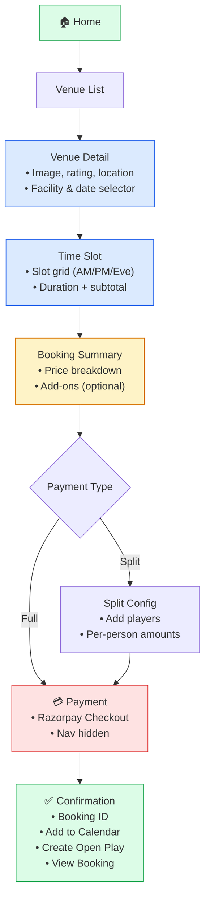

# UI & UX Requirements — Summary

**Version:** 2.1  
**Last updated:** Mar 2026

This document consolidates all **UI and UX requirements** from Navigation, Booking Flow UX, Booking State & Flows, FRD screens, and Payment Gateway docs. Use it for design (Figma), implementation, and QA.

---

## 1. Philosophy & goals

| Principle | Requirement |
|-----------|-------------|
| **Booking = revenue** | Navigation and flow must prioritize booking as the main path. |
| **Open Play + Stats = retention** | Keep users engaged; Stats in 1 tap. |
| **User types** | **Casual:** Home → Book → Done. **Competitive:** Open Play → Match → Stats → Leaderboard. |
| **Flow feel** | Fast, clean, trustworthy, premium — **3–5 taps max** to confirm booking. |
| **Trust** | Transparency in pricing (subtotal, GST, add-ons, total); no hidden fees. |
| **Booking engine tone** | Urgency without panic; competition without toxicity; calm premium UI; live updates without chaos. |

**Do not:** Flashing warnings, public payment % display, countdown panic timers, chaotic animation.

---

## 2. Navigation

### 2.1 Single bottom nav (5 tabs)

A **single bottom nav** for all users with 5 tabs: **Home** | **Venues** | **Matches** | **Train** | **Profile**.

| Tab | Purpose |
|-----|---------|
| **Home** | Discovery, next game, featured venues, quick actions |
| **Venues** | Search, browse venues, facility discovery |
| **Matches** | Upcoming / Live / Completed matches |
| **Train** | Training batches, trainer discovery |
| **Profile** | User card, My Batches, My Tournaments, Switch Role, settings |

**Role-specific routes** live under path segments:
- `/trainer/*` — Trainer Mode (Dashboard, Batches, Sessions, Payments)
- `/venue-owner/*` — Venue Owner Mode (Dashboard, Bookings, Facilities, Payments)

Role switching via Profile → Switch Role. Mode persisted in `localStorage`.

### 2.2 When to hide bottom nav

- Auth (splash, login, register)
- Payment flow
- Live Match (scoring)
- Create Tournament flow

Implementation: `NavContext` in `apps/web/src` — `setHideBottomNav(true)` on enter, `setHideBottomNav(false)` on exit.

### 2.3 Secondary patterns

| Pattern | Use for | Behavior |
|---------|---------|----------|
| **Stack** | Venue → Slot → Payment; Open Play → Join; Tournament → Fixture → Match | Back only; tab unchanged; max **4 levels** deep. |
| **Modal** | Filters, add-ons, select sport, split payment editor | Slide-up, **60–80% height**; dismiss by backdrop or close. |
| **Full-screen (immersive)** | Payment, Live Match | Full screen; bottom nav hidden. |

### 2.4 UX behavior rules (navigation)

1. **Never more than 3 taps to book** (from Home to confirmation).
2. **Back** always returns logically (stack or modal close).
3. **No deep nesting** beyond 4 levels.
4. **Stats** always accessible in **1 tap** (via Matches or Train tab).

### 2.5 Role-specific routes (Implemented)

- **Profile → Switch Role** → navigate to role-specific routes; bottom nav stays the same (Home, Venues, Matches, Train, Profile).
- **Trainer Mode:** Routes under `/trainer/*` — Dashboard (today's sessions, stats), Batches (list, create, batch detail with 5 tabs), Sessions (aggregated across batches), Payments (revenue summary, pending/collected). Access via Train tab or Profile.
- **Venue Owner Mode:** Routes under `/venue-owner/*` — Dashboard (bookings, revenue, occupancy), Bookings (calendar view), Facilities (management), Payments (analytics). Access via Profile.
- Full details: **docs/VENUE_OWNER_AND_TRAINER_VIEWS.md**.

---

## 3. Booking flow (screen-by-screen)

### 3.1 Flow structure

```
Home → Venue List → Venue Detail → Select Facility + Date → Time Slot → Booking Summary
  → [Add-ons optional] → Payment Type (Full / Split) → Payment → Confirmation
```



- **Max 3 major screens before payment:** Venue Detail → Slot → Summary (then Payment Type → Payment).
- **Sticky CTA** and **total amount** always visible where relevant.

### 3.2 Venue Detail

| Zone | Content |
|------|--------|
| Top | Image carousel, Venue name, Rating, Location |
| Middle | Sport selector (if multi-sport), **Facility selector**, **Date selector** (horizontal scroll) |
| Bottom | Time slot preview, **Sticky “Select Slot” CTA** |

- Date selector: horizontal scroll; default = **Today**; unavailable dates disabled/greyed.
- Show **price per hour** clearly.

### 3.3 Time Slot Selection

| Zone | Content |
|------|--------|
| Top | Selected date, Facility name, Sport |
| Middle | **Grid of time slots** (Morning / Afternoon / Evening) |
| Bottom | **Sticky bar:** Selected duration, Estimated price, **Continue** |

**Slot states (visual):**

| State | Visual | Interaction |
|-------|--------|-------------|
| Available | bg/secondary (e.g. light grey) | Tappable |
| Selected | accent/primary | Tappable, can deselect |
| Booked | Muted + disabled | Not tappable |
| Unavailable | ~40% opacity | Not tappable |

**Slot availability (user view) — from booking engine:**

| UI state | Condition |
|----------|-----------|
| **Available** | No bookings |
| **High demand · n groups** | Pending bookings exist; show **competition count** |
| **Booked** | Confirmed booking exists |
| **Past** | Slot time passed |

- **Competition count** (other pending groups): show on **Slot grid** and **Booking summary**; **not** after confirmation.
- Multi-slot: allow consecutive slots; **live** “X hours selected” and subtotal update.

### 3.4 Booking Summary

- **Section 1 — Booking details:** Venue, Sport, Facility, Date, Time range.
- **Section 2 — Price breakdown:** Subtotal (e.g. 2 hrs × ₹1200), GST (e.g. 18%), **Total** (large, prominent).
- **Section 3 — Add-ons:** Expandable card; “Add” opens add-on **modal**; total updates live when adding/removing.
- No hidden fees; every line item visible.

### 3.5 Payment Type

- **Toggle:** Pay Full | Split.
- **Pay Full:** “Continue” → Payment screen.
- **Split:** “Continue” → Split configuration (You + Add players; per-person amount editable; sum must equal total; show error if mismatch).

### 3.6 Payment Screen

- **Full-screen focus;** bottom nav **hidden**.
- Top: **Total amount** (prominent). Middle: Payment UI (e.g. Razorpay). Bottom: **Pay Now**.
- Minimal chrome; user must see total again before paying.

### 3.7 Confirmation

- Large success icon; “Booking Confirmed”; Date, Time, Venue, **Booking ID**.
- **Actions:** Add to Calendar, **Create Open Play**, View Booking.
- Celebratory but not noisy; “Create Open Play” as one-tap retention hook.

---

## 4. Real-time & feedback

### 4.1 Real-time engine (booking)

- Listen to: `booking_created`, `booking_payment_update`, `booking_confirmed`, `booking_cancelled_conflict`, `booking_cancelled_user`.
- **UI:** Slot state updates instantly; competition count updates live; conflict shows **toast/modal**.
- **No** hard refresh; **no** chaotic animation.

### 4.2 When to update price/breakdown instantly

- Changing **duration** (slot selection).
- **Adding or removing add-ons.**
- **Changing split** (amounts or number of people).

Rule: No lag; no “loading” for price — update as user changes inputs.

### 4.3 Error handling

**Slot booked during payment**

- Show **modal:** “Slot no longer available.”
- **Action:** Return to **Time Slot Selection** (or Venue Detail) to choose another slot.
- Do not leave user on payment with an invalid slot.

---

## 5. Application screens (reference)

Screens are **mobile-first**, Figma dark theme. Routes: `/login`, `/register`, `/app` (tabs and stack).

| Screen | Module | Purpose | Status |
|--------|--------|---------|--------|
| Login, Register | Auth | Auth0 (Google SSO, Email OTP, Magic Link) | Designed |
| Home tab | Home | Discovery, next game, featured venues, Improve Your Game | Designed |
| Venue List, Venue Detail, Venue Reviews | Booking / Discovery | Search, facility, date, ratings, surface type | Designed |
| Time Slot, Booking Summary, Payment Type, Payment, Confirmation | Booking | Core booking flow, add-on increment/decrement | Designed |
| Bookings tab, Booking Detail, Payment History, Payment Receipt | Bookings | Upcoming, past, cancel, receipts | Designed |
| Open Play tab, Open Play Detail, Create Open Play, Manage session | Open Play | Discover, join, create, manage | Designed |
| Stats overview, Sport Analytics Hub, Sport Dashboard, Match Analytics | Stats | Multi-sport analytics, KPI cards, charts | Designed |
| Leaderboard | Stats | Sport filter, ranked list | Designed |
| Match list, Live Match | Matches | Sport-specific scoring (Tennis, Badminton, Football, Basketball, Cricket) | Designed |
| Trainer List, Trainer Detail, Trainer Reviews | Discovery | Trainers, ratings, batches | Designed |
| Batch Detail (Player) | Training | Join batch with confirmation modal | Designed |
| Profile tab | Profile | User card, My Batches, My Tournaments, Switch Role | Designed |
| Create Tournament, Tournament List, Tournament Detail | Tournaments | Full lifecycle, format-specific views | Designed |
| Trainer Dashboard | Trainer Mode | Today's sessions, stats, announcements | Designed |
| Trainer Batches, Create Batch | Trainer Mode | List, create with venue/custom | Designed |
| Trainer Batch Detail | Trainer Mode | 5 tabs: Players, Sessions, Attendance, Payments, Announcements | Designed |
| Trainer Sessions | Trainer Mode | Aggregated sessions with filters | Designed |
| Trainer Payments | Trainer Mode | Revenue summary, pending/collected | Designed |
| Venue Dashboard, Venue Bookings, Venue Facilities, Venue Payments | Venue Owner Mode | Management and analytics | Designed |
| Splash, Forgot password, Edit Profile, Settings | Misc | Auth, account | Pending |

---

## 6. Interaction rules (summary)

| Rule | Implementation |
|------|-----------------|
| Max 3 major screens before payment | Venue Detail → Slot → Summary → Payment Type → Payment. |
| Sticky CTA always visible | Venue Detail: “Select Slot”. Slot: “Continue”. Summary: “Continue to payment”. |
| Total amount visible before payment | Summary and Payment Type show total; Payment screen shows total at top. |
| Never hide pricing | Subtotal, GST, add-ons, total in summary; per-person in split. |
| Back logical | Stack or modal close; no dead ends. |
| Stats in 1 tap | Stats tab. |

---

## 7. Future development

Planned features outside current MVP are documented in **[FUTURE_DEVELOPMENT.md](FUTURE_DEVELOPMENT.md)**. Notable item:

- **Video analytics using AI:** Ingest video (match/training footage) and use AI to derive analytics (events, movement, key moments, metrics) and surface them in the app, with optional integration into Stats and Matches.

---

## 8. Related documents

- **This doc (HTML):** [ui-ux-requirements-summary.html](ui-ux-requirements-summary.html)
- **Future development (roadmap):** [FUTURE_DEVELOPMENT.md](FUTURE_DEVELOPMENT.md)
- **Navigation (full map, routes):** [NAVIGATION.md](NAVIGATION.md), [navigation.html](navigation.html)
- **Booking flow (detailed UX):** [BOOKING_FLOW_UX.md](BOOKING_FLOW_UX.md)
- **Booking state & flows (engine, slot competition, refunds):** [BOOKING_STATE_AND_FLOWS.md](BOOKING_STATE_AND_FLOWS.md), [booking-state-and-flows.html](booking-state-and-flows.html)
- **Screens & modules:** [FRD.md](FRD.md) §12
- **Payment gateway (client flow):** [PAYMENT_GATEWAY_ARCHITECTURE.md](PAYMENT_GATEWAY_ARCHITECTURE.md)
- **Venue Owner & Trainer views:** [VENUE_OWNER_AND_TRAINER_VIEWS.md](VENUE_OWNER_AND_TRAINER_VIEWS.md)
- **Implementation status:** [IMPLEMENTATION_STATUS.md](IMPLEMENTATION_STATUS.md)
- **Traceability:** [TRACEABILITY.md](TRACEABILITY.md), [traceability.html](traceability.html)
